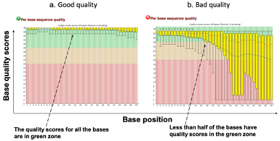
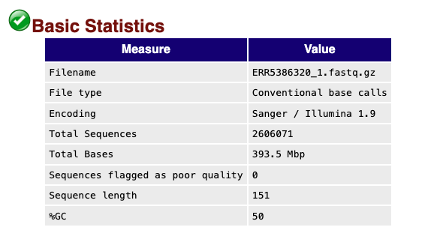
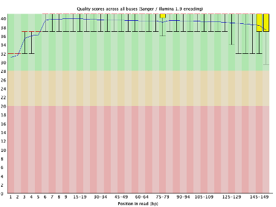
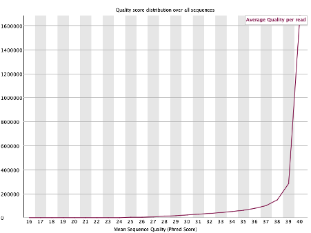
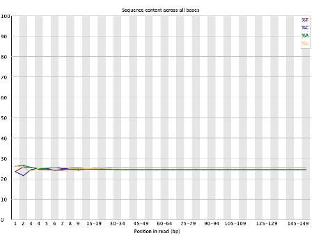
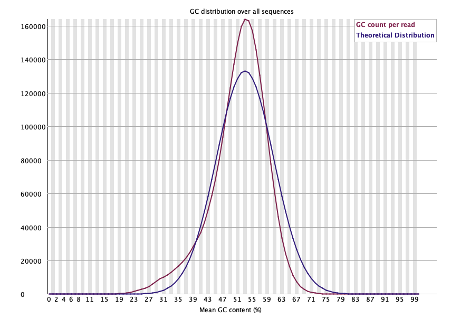
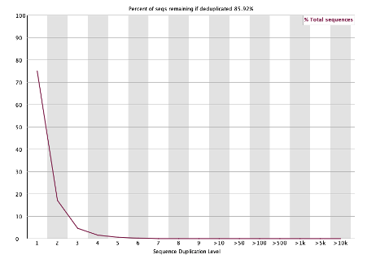
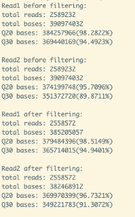

# Computational practical 2: Accessing Data and Quality Control

**Original Module Developers:** Dr. Stanford Kwenda, Mr. Collins Kigen and Mr Mishalan Moodley

Modified by Elizabeth Batty, January 2025

## Table Of Contents

[Introduction](#intro)

1. [Downloading raw data](#download)
2. [Running the FastQC tool](#runfastqc)
3. [Basic statistics](#basics)
4. [Per base sequence quality](#perbase)
5. [Per sequence quality scores](#persequence)
6. [Per base sequence content](#persequencecontent)
7. [Per sequence GC content](#persequencegc)
8. [Per base N content](#perbasen)
9. [Sequence duplication levels](#duplication)
10. [Adapter content](#adapters)
11. [QC Exercise and Quiz](#qcexercise)
12. [Filtering and trimming of sequence reads](#filttrim)
13. [Trimming Exercise and Quiz](#trimexercise)

# Introduction <a name="intro"></a>
A typical whole genome sequencing process involves genomic DNA isolation, library preparation and sequencing. Errors occurring at any of these steps can negatively impact the quality of the sequence information and hence affect downstream analysis. For example, the samples could be mixed up or contaminated during sample or library preparation, or errors can be encountered during the sequencing itself. If these errors are not removed from the raw reads, they might be incorporated into your analysis output and would be harder to resolve later on. Therefore, it is important to perform quality checks on the raw sequence reads before starting your analysis.

There are several bioinformatic tools available for evaluating read data quality, here we will discuss one of the widely used tools, called [FastQC](https://www.bioinformatics.babraham.ac.uk/projects/fastqc/). The tool can be run on the command-line and also has a graphical user interface. The tool provides you with a report on the quality of sequence reads using a traffic light system: red, amber and green. There are a number of parameters which we will learn in this module that help us in assessing the sequence data quality. Below are the two screenshots generated by the FastQC tool showing (a) good sequence data and (b) bad sequence data. 



## Downloading raw data<a name="intro"></a>
Let's assess the sequence data quality of an isolate of *Escherichia coli* (ERR5386320). We will download this sequence data from the European Nucleotide Archive, a data archive which contains public sequencing data from thousands of bacterial sequencing projects. ERR5386320 is the accession number which allows you to find this data in the public archives.

Open your browser and navigate to https://www.ebi.ac.uk/ena/browser/view/ERR5386320 to look at the data available for this sample.

Now open the terminal and change your working directory to the directory with the files for this practical, which is a folder called cp2.

`cd /home/data/cp2`

Download the sequence reads (fastq files) for analysis by entering the following commands one after the other.

```
wget ftp://ftp.sra.ebi.ac.uk/vol1/fastq/ERR538/000/ERR5386320/ERR5386320_1.fastq.gz

wget ftp://ftp.sra.ebi.ac.uk/vol1/fastq/ERR538/000/ERR5386320/ERR5386320_2.fastq.gz
```
## Running the FastQC tool<a name="runfastqc"></a>

Run the following command to run the fastqc tool on both the read files:

`fastqc ERR5386320_1.fastq.gz ERR5386320_2.fastq.gz`

Note: The program will exit with an error if the downloaded “.gz” files are truncated/not downloaded completely. If you face such an error, please download the file again using the `wget` commands and rerun `fastqc`. 

Upon successful completion `fastqc` will create an analysis report in html format, one for each read file named after the name of the file you used as input. We can see the report by opening the html file in the web-browser.

Let's take a look at the graphs generated for ERR5386320_1.fastq, the first read in our read pairs.

## Basic statistics <a name="basics"></a>

 

This is a table containing basic information gleaned from the sequence reads such as total number of reads, length (range) of sequence reads and GC%. From this table alone, we can infer average coverage (total number of reads and length of reads) and compare the GC content with the species that we expect the isolate to belong to. 
In our example, we have an *Escherichia coli* isolate that has a GC percent of around 50%. This matches with the reported GC% of our reads.

## Per base sequence quality <a name="perbase"></a>

 

The y-axis on the graph shows the quality scores and the x-axis represents the base positions in the reads. The blue line shows the mean quality of bases for each position in the reads. The space coloured in the green regions shows high quality, the amber coloured region below reflects acceptable quality and the regions in the red shows low quality. Therefore, if you observe the blue line in the red region for your sequence reads, it means the quality of your sequence reads is low and may contain more errors. These reads need trimming before any downstream analysis to remove low-quality bases.

## Per sequence quality <a name="persequence"></a>

 

The per sequence quality score report shows how many reads have overall low quality values. The x-axis shows the mean quality score for each sequence, where a higher number indicates higher quality, and the y-axis shows a count of how many sequences there are with that mean quality score. If a significant proportion of the sequences in a run have overall low quality then this could indicate some kind of systematic problem - possible with just part of the run (for example one end of a flowcell). If you suspect an error on part of the flowcell, you can identify this by looking at the diagnostic reports on the Illumina machine itself, or by looking at the per-tile sequence quality.

## Per base sequence content <a name="persequencecontent"></a>

 

The graph above shows the overall GC content at each of the read positions with X-axis being the base position in the reads and Y-axis showing the percentage of A,T,G and C. For a good library the lines should run parallel reflecting no difference in base calling for each of the 4 bases. The relative amount of each base should reflect the overall composition of the genome. In our case the GC% is around 50 and so each individual base is around 25% of the sequences.

## Per sequence GC content <a name="persequencegc"></a>

 

The figure shows the theoretical distribution of GC content per sequence based on the GC percent of the genome, and the actual distribution in your sample. In a normal random library you have a roughly normal distribution of GC content (a single peak) where the peak corresponds to the overall GC content of the underlying genome. An unusually shaped distribution could indicate a contaminated library or some other kind of bias in library prep. 

## Per base N content <a name="perbasen"></a>

 

If a sequencer is unable to make a base call with sufficient confidence then it will normally substitute an N rather than a conventional base call. This module plots out the percentage of base calls at each position for which an N was called. It's not unusual to have a very low proportion of Ns especially nearer the end of reads. However, if proportion is higher that could cause problems in downstream analysis.

## Sequence duplication <a name="duplication"></a>

 

This figure shows the proportion of sequences in your library which are unique, or which occur more than once in your library. In a diverse library where the input DNA was randomly fragmented most sequences will occur only once in the final set. A low level of duplication may indicate a very high level of coverage of the target sequence, but a high level of duplication is more likely to indicate some kind of enrichment bias (e.g., PCR overamplification). This module counts the degree of duplication for every sequence in a library and creates a plot showing the relative number of sequences with different degrees of duplications.

## Adapter content <a name="adapters"></a>

 

It is important to ensure that the sequence reads are not contaminated with adapter sequences used in library preparation. This module reports the abundance of various adapters used in sequencing. The plot above shows a cumulative percentage count of the proportion of the reads at each position that matches adapter sequences. Once a sequence has been seen in a read, it is counted as being present right through to the end of the read so the percentages you see will only increase as the read length goes on. 

From all the above data metrics it appears that the sequence reads of the isolate ERR5386320 are of good quality and can be used to run the downstream analysis.


## QC Exercise and Quiz <a name="qcexercise"></a>

Now run the fastqc tool on the sequence reads of another isolate cpe079. The ENA accession number is ERR5386380. This is an isolate of Pseudomonas aeruginosa. The files are located within the folder cp2. Analyse the graphs generated by the tool and answer the following questions:
1. What is the GC content of the isolate?
2. Which of the two reads have the lowest quality? What information do you use to determine this?
3. What commands would you use to download the raw data for isolate cpe079 from the ENA?

If you would like to see examples of FastQC plots generated when sequencing goes wrong, you can look on the [QCFail site](https://sequencing.qcfail.com/software/fastqc/).

## Filtering and trimming of sequence reads<a name="filttrim"></a>
Once we have assessed the quality of the sequence reads, sometimes we spot bases with lower quality, particularly in read 2 files. These low quality bases need to be trimmed and here we are going to use another tool fastp for this purpose. fastp is a very fast QC and trimming command, which can be configured in many ways. Run the command `fastp` to see all the different options you can use or look at the website.

## Trimming Exercise and Quiz <a name="trimexercise"></a>
Here, we will run fastp on the isolate ERR5386380 that we used in the quiz above. Run the following command (in a single line) to initiate the tool:

`fastp --in1 ERR5386380_1.fastq.gz --in2 ERR5386380_2.fastq.gz --out1 ERR5386380_1.trimmed.fastq.gz --out2 ERR5386380_2.trimmed.fastq.gz --length_required 40 --cut_front --cut_tail --cut_mean_quality 25`

In the command above we have used a number of options which are explained below:
`--in1` and `--in2` are the two input files with the raw data from read 1 and read 2.
`--out1` and `--out2` are the two output files which give the read data remaining after trimming. 
`--cut_front` will trim low quality bases from the start of the read - it looks at a sliding window starting from the front of the read and removes the bases in the window if the mean quality is below the threshold (and stops if the bases are above the threshold).
`--cut_tail` performs the same operation starting from the end of the read and moving towards the front.
`--cut_mean_quality` sets the quality threshold for cut_front and cut_tail
`--length_required` will remove any reads which are below this threshold after the low quality bases are removed

`fastp` will perform other quality filtering by default if you do not tell it not to do so. It will trim off the adapter sequences, remove bad reads with too many Ns or reads which are too short after filtering. It will also by default return only paired reads - if the first read in a pair fails QC filtering, it also removes the paired read in the read 2 file. 

When you run `fastp` it will output some statistics like the example screenshot below:
 
 

Here, we can see the number of reads which were retained after trimming and filtering. The full output message tells us how many reads failed for each QC criterion. The filtered and trimmed reads (`ERR5386380_1.trimmed.fastq.gz` and `ERR5386380_2.trimmed.fastq.gz`) will be in the same folder and can be used for the downstream analysis steps. fastp will also generate an HTML file (default name is fastp.html) with more information on the trimming and some other QC information - open this file in a web browser to see the output.

**Quiz: How many reads were removed by fastp due to a) low quality, b) too many Ns, and c) were too short after filtering?**

You can run `fastqc` on the filtered files (`ERR5386380_1.trimmed.fastq.gz` and `ERR5386380_2.trimmed.fastq.gz`) and check how have the metrics improved by comparing the reports before and after we ran `fastp`. 

