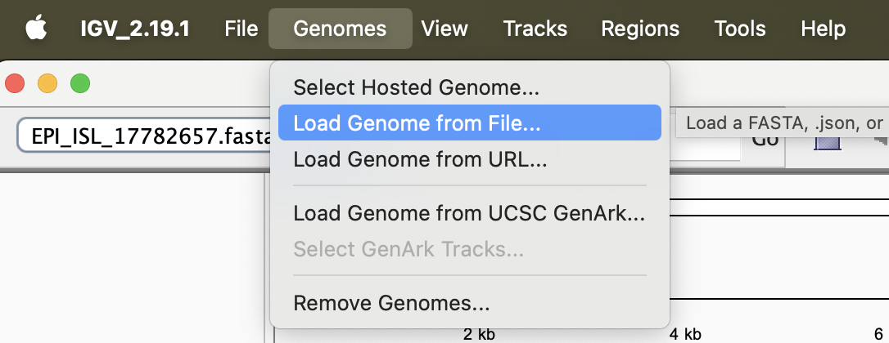
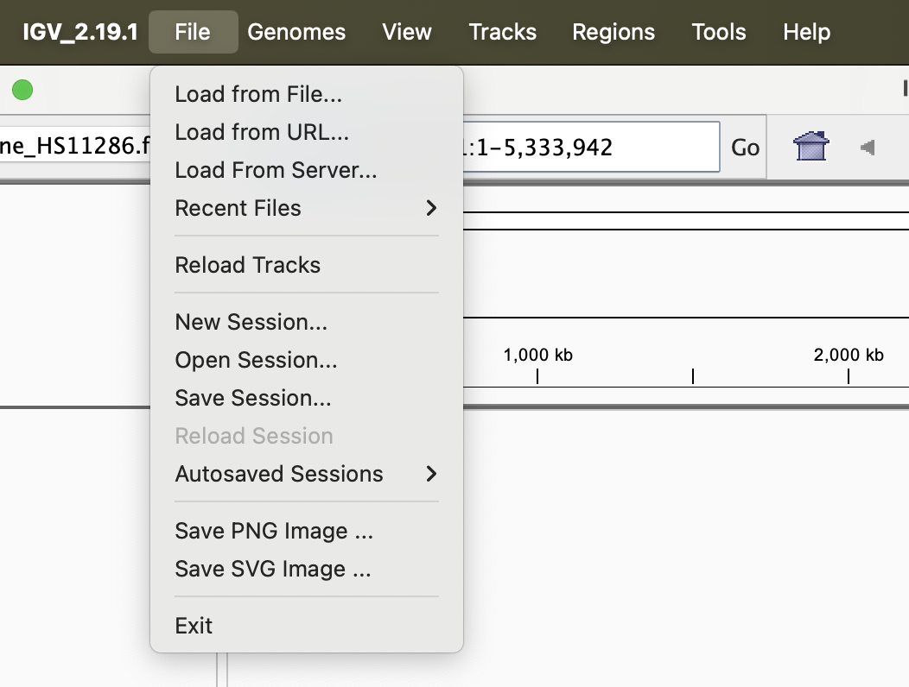
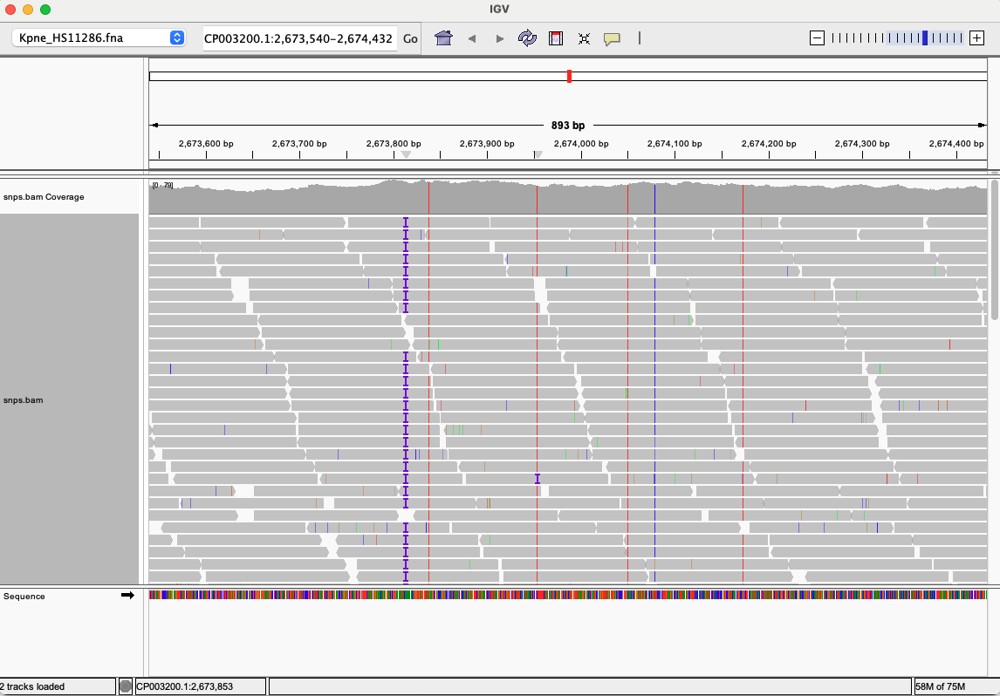

# Computational Practical: Genome Alignment and SNP Calling in Bacterial Genomes
Original version by Dr Arun Gonzales Decano, modified by Liz Batty September 2025

## Table of Contents
1. [Introduction](#intro)
2. [Prerequisites](#prereq)
3. [Data preparation](#dataprep)
4. [Short Read Alignment and SNP Calling with Snippy](#snippy)
5. [Post-processing and Analysis](#postprocessing)

## Introduction  <a name="intro"></a>

Variant calling involves crucial steps in comparative genomics that researchers to identify genetic variations between bacterial strains. Short-read sequencing data (from Illumina) and long-read sequencing data (from PacBio or Oxford Nanopore) have distinct characteristics, each with specific tools and methods for optimal processing. This tutorial provides step-by-step instructions for performing SNP (Single Nucleotide Polymorphism) and other forms of variant calling in bacterial genomes using short-read sequencing data, with an optional exercise looking at long-read data at the end of the practical.

## Prerequisites <a name="prereq"></a>

Before starting, load up the conda environment for this practical:
`conda activate AlignmentAndVariantCalling`

And check you have the following tools available:
  - fastp
  - snippy
  - samtools
  - bcftools
  - fastqc
  - snpeff

## Data Preparation <a name="dataprep"></a>

We will map Illumina short read data from a strain of _Klebsiella pneumoniae_. The data files you will need (read files, and a reference genome) are already downloaded for you and are in the `data` subdirectory of the `AlignmentAndVariantCalling` directory.

<details>
    <summary>Downloading data</summary>
    The following commands were used to download the data directly from the Sequence Read Archive.

```
curl -o ERR4095905_1.fastq.gz https://ftp.sra.ebi.ac.uk/vol1/fastq/ERR409/005/ERR4095905/ERR4095905_1.fastq.gz
curl -o ERR4095905_2.fastq.gz https://ftp.sra.ebi.ac.uk/vol1/fastq/ERR409/005/ERR4095905/ERR4095905_2.fastq.gz
```

Download a Klebsiella pneumoniae reference genome from https://www.ncbi.nlm.nih.gov/datasets/genome/GCF_000240185.1/

</details>


## Short Read Alignment and SNP Calling with Snippy <a name="snippy"></a>
First we prepare our data using `fastp` to remove adapters and low-quality bases, as we practiced in the Data QC module.

```bash
fastp -i data/ERR4095905_1.fastq.gz -I data/ERR4095905_2.fastq.gz -o out.ERR4095905_1.fastq.gz -O out.ERR4095905_2.fastq.gz
```

[Snippy](https://github.com/tseemann/snippy) is an all-in-one tool for bacterial SNP calling using short-read data. It aligns the reads to a reference genome and calls variants.

Run Snippy and examine the output.

```bash
snippy --cpus 1 --outdir ERR4095905_snippy --reference data/Kpne_HS11286.fna --R1 out.ERR4095905_1.fastq.gz --R2 out.ERR4095905_2.fastq.gz
```

This will take about ten minutes to run. All the output files from your Snippy run will be placed in the output directory `ERR4095905_snippy`. Look at the output files and refer to the Snippy homepage to tell you what is in each output file.

 A file ending in VCF is in the [Variant Call Format](https://en.wikipedia.org/wiki/Variant_Call_Format), which is a specific file format designed to hold information on genetic variants. A BAM file and the associated BAI index file are a specific file format which contains the reads aligned to the reference genome. A BAM file is a binary file which must be viewed
 using the `samtools` application.

| Filename | Description |
| snps.vcf | The called SNPs in VCF format |
| snps.tab | A tabular summary of SNPs |
| alignment.bam | The aligned reads in BAM format |
| alignment.bam.bai | The BAM index file |

Now we run snippy-core and examine the output. Snippy-core compares the output of SNP calling on multiple samples run using Snippy to look at the 'core' genome, where we can call variants in all samples. Three samples previously run on Snippy can be found in the `AlignmentAndVariantCalling/snippy` directory. First, navigate to this directory, and then run Snippy-core across all samples:

```
snippy-core --ref Kpne_HS11286.fna snippy/ERR4095905_snippy/ snippy/ERR4095977_snippy/ snippy/ERR9419473_snippy/
```

Note the formats and contents of each output file. By default all the files produced by snippy-core will starting with `core.`

## Post-processing and Analysis <a name="postprocess"></a>

### 1. Filter SNPs

Make sure you are back in the root directory for this module (`AlignmentAndVariantCalling` and not the `snippy` subdirectory).

We can also apply filters to the VCF files to remove or tag low-quality SNPs using `bcftools`. For instance, to remove SNPs with a depth of coverage (DP) below 30 for the sample ERR4095905:

```
bcftools filter -e 'FMT/DP<30' ERR4095905_snippy/snps.vcf > ERR4095905_snps.depthfilter.vcf
```

How many SNPs were removed through filtering?
<detail><summary>Hint</summary>
You can count the number of lines in the SNP file before and after filtering using the `wc -l` command.
</detail>

### 2. Visualization
Visualize the alignment and SNPs using tools using [Integrative Genomics Viewer (IGV)](https://igv.org/doc/desktop/#DownloadPage/). This cannot be installed using Conda but you can download it directly to your computer.

First you need to load the reference genome we used for alignment, which is called `Kpne_HS11286.fna`:



Then you can load BAM files of sequence reads which are mapped to the genome. Snippy produces a BAM file which is always called `snps.bam`. You can find this in the directory with your Snippy output. Load this file using the `File` menu:



Now use the zoom commands in the top right to zoom in until you can see the reads. You should have a screen which looks a little like this:


### Long read variant calling
Variant calling from long reads can be performed in a similar way to short reads but using different tools designed for long read sequencing.
<details><summary>Long read variant calling protocol</summary>

Long Read Alignment with minimap2 and SNP Calling with Medaka or DeepVariant.

First you need to install medaka, which you can do in any conda enviroment with the command:

```
conda install medaka
```

### Run Medaka:
- Use Medaka to call SNPs from the long-read input file. We can use the input file we will use for the genome assembly practical tomorrow:

```
course_data_2025/GenomeAssemblyAndAnnotation/data/cpe004_filtered.fastq.gz
```

This is a sample of _Klebsiella pneumoniae_ as well.
`medaka` is a long read alignment and variant calling tool provided by Oxford Nanopore.
Documentation: https://github.com/nanoporetech/medaka

Run `medaka` on the long read file with the following command - replace the 'longread.input.fastq.gz' and 'reference.fasta' with the long reads and the _Klebsiella pneumoniae_ reference genome we used previously:

```
medaka_variant -i longread.input.fastq.gz -r reference.fasta
```

The `-m` parameter selects the Nanopore basecalling model to use. This is based on the flow cell version, the machine, and the basecalling model used for your data. If you do not supply the `-m` parameter to `medaka` it will automatically select one.

This sample is closely related (but not identical to) the sample we performed short-read variant calling on earlier. The `medaka` variant calling also produces a BAM file - load them both into IGV and compare the alignments and variant calls. What do you notice?

<!--
### Run DeepVariant: (Optional)
- Use minimap2 for aligning long reads.
```
minimap2 -a reference.fasta long_reads.fastq > aligned_long_reads.sam
```

- Convert and sort the alignment.
```
samtools view -S -b aligned_long_reads.sam > aligned_long_reads.bam
samtools sort aligned_long_reads.bam -o sorted_long_reads.bam
```

- Index the BAM file.
```
samtools index sorted_long_reads.bam
```
- Remove duplicates.
```
samtools rmdup sorted_long_reads.bam deduplicated.bam
```

- Use DeepVariant to call SNPs from the long-read BAM file.
```
# Assuming DeepVariant is installed and properly set up

run_deepvariant --model_type PACBIO --ref reference.fasta --reads sorted_long_reads.bam --output_vcf dv_output.vcf --output_gvcf dv_output.g.vcf --num_shards 4
```

</details>
-->
## References

1. Bush SJ, Foster D, Eyre DW, Clark EL, De Maio N, Shaw LP, Stoesser N, Peto TEA, Crook DW, Walker AS, Wilson DJ. (2020). Genomic diversity affects the accuracy of bacterial SNP calling pipelines. Genome Biology, 21, 20. https://doi.org/10.1186/s13059-019-1921-9

2. Li H. (2018). Minimap2: pairwise alignment for nucleotide sequences. Bioinformatics, 34(18), 3094-3100. https://doi.org/10.1093/bioinformatics/bty191

3. Poplin R, Chang PC, Alexander D, Schwartz S, Colthurst T, Ku A, Newburger D, Dijamco J, Nguyen N, Afshar PT, Gross SS, Dorfman L, McLean CY, DePristo MA. (2018). A universal SNP and small-indel variant caller using deep neural networks. Nature Biotechnology, 36(10), 983-987. https://doi.org/10.1038/nbt.4235

4. Cingolani P, Platts A, Wang LL, Coon M, Nguyen T, Wang L, Land SJ, Lu X, Ruden DM. (2012). A program for annotating and predicting the effects of single nucleotide polymorphisms, SnpEff: SNPs in the genome of Drosophila melanogaster strain w1118; iso-2; iso-3. Fly, 6(2), 80-92. https://doi.org/10.4161/fly.19695

5. Robinson JT, Thorvaldsdóttir H, Winckler W, Guttman M, Lander ES, Getz G, Mesirov JP. (2011). Integrative genomics viewer. Nature Biotechnology, 29(1), 24-26. https://doi.org/10.1038/nbt.1754
