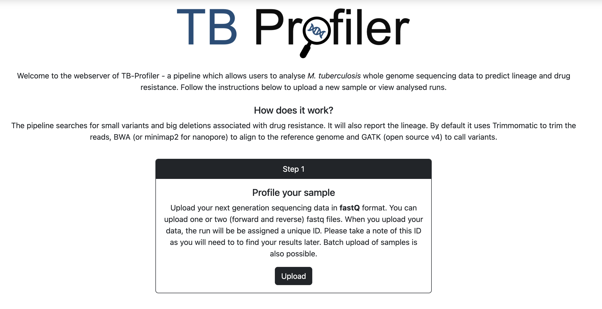
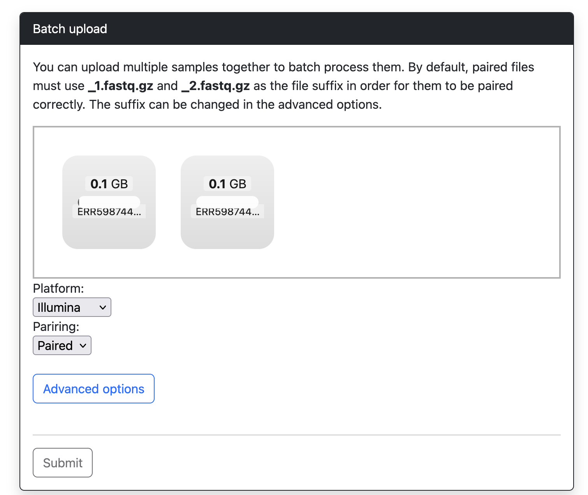
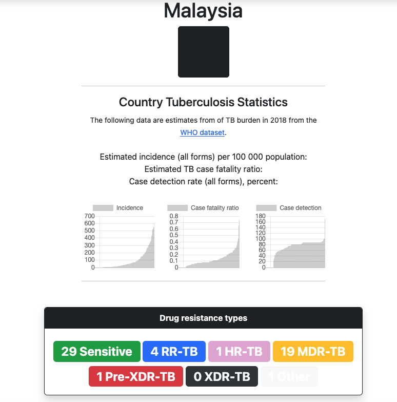
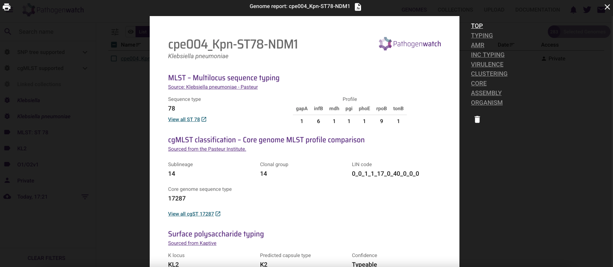
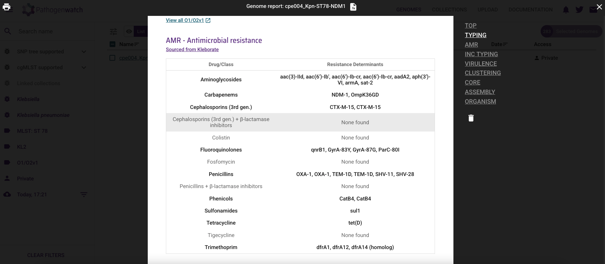

# Computational Practical: Detecting antimicrobial resistance from bacterial genomes

## Table of Contents
1. [Introduction](#intro)
2. [Bacterial strains to be analysed](#strains)
3. [AMR detection using AMRFinderPlus command line](#amrfinder)
4. [AMR detection for tuberculosis using TBProfiler](#tbprofiler)
5. [AMR detection using Pathogenwatch](#pathogenwatch)
6. [AMR detection for melioidosis using ARdAP](#ardap)
7. [AMR detection using Resfinder (optional)](#resfinder)

## Introduction <a name="intro"></a>

Growing rates of antimicrobial resistance make antibiotic susceptibility testing (AST) increasingly needed to ensure the right antibiotics are prescribed for patients with bacterial infections. Determining antibiotic susceptibility is preferred over empiric therapy, wherein typically broad-spectrum drugs are used without a definitive confirmation of the infectious agent and which antibiotics infectious bacteria are resistant to. Data collected on antibiograms (strains’ full susceptibility pattern) can also be used for surveillance purposes and, in turn, inform empiric therapy.

AST is routinely performed using culture-based techniques in clinical diagnostic laboratories, frequently disk diffusion, broth microdilution and gradient diffusion (i.e., E-test). As antibiotic resistance is genetically encoded, i.e. mediated by acquisition of new genes, gene copy number, or mutations in regulatory and coding regions of existing chromosomal genes, molecular tests have been developed to target the detection of such genetic markers. In the last decade, whole-genome sequencing has emerged as an alternative technology to both culture and targeted molecular tests for the detection of AMR as it can, in principle, detect all AMR genetic determinants and predict resistance to all antibiotics in a single experiment. The accuracy of genotypic predictions depends on the availability of: (1) accurate databases of AMR genetic determinants, (2) large collections of whole-genome sequenced strains with AST measurements to assess the diagnostic accuracy of such catalogues, and (3) automated genome analysis and interpretation tools.

Mutational (chromosomal) resistance is the main driver of acquired resistance in certain bacterial species, such as *Mycobacterium tuberculosis* and *Helicobacter pylori*, or for particular antibiotics, especially to synthetic agents such as fluoroquinolones and oxazolidinones. Resistance mutations are vertically transmitted, i.e., via clonal reproduction of bacteria, or can be transmitted horizontally via homologous recombination between different strains. Gene-mediated resistance is the main driver of acquired resistance in certain bacterial species, particularly in gram-negatives. Resistance genes can be horizontally transmitted (via mobile genetic elements such as plasmids) and vertically transmitted via clonal reproduction of bacteria, particularly stable if integrated into the chromosome. In some bacterial species, chromosomal and gene-mediated resistance are equally common (e.g., *Staphylococcus aureus*). Resistance to the same antibiotic can be conferred by both mutations and acquired genes (e.g., fusidic acid in Staphylococcus aureus, colistin resistance in *Escherichia coli*).

Over the years, several global studies have identified the genes and mutations that confer resistance to particular antibiotics. There are several databases such as the [Comprehensive Antimicrobial Resistance Database (CARD)](https://card.mcmaster.ca/), [ResFinder](https://cge.cbs.dtu.dk/services/ResFinder/), [AMRFinder](https://www.ncbi.nlm.nih.gov/pathogens/antimicrobial-resistance/AMRFinder/) or [Pathogenwatch](https://pathogen.watch/) that contain information about the genes and mutations that confer resistance. The use of these databases and tools depends on the species and mechanisms of resistance one is interested in.

## Bacterial strains to be analysed in this practical <a name="strains"></a>

Table 1 contains the list of strains to be analysed in this practical from a carbapenemase-resistant enterobacteriaceae outbreak. Table 2 contains additional strains to be analysed (optionally, if time allows) sourced from key studies on the genomic epidemiology of methicillin-resistant *Staphylococcus aureus* (MRSA) ([Holden *et al.* 2013](https://doi.org/10.1101/gr.147710.112)) and extensively drug-resistant (XDR) *Salmonella typhi* ([Klemm *et al.* 2018](https://doi.org/10.1128/mbio.00105-18)). In this practical we will use a command line-based tool (NCBI AMRFinder) and a web-based tool (ResFinder) to identify AMR genetic determinants from whole-genome sequences, and look at a specific tool used to detect resistance in *Mycobacterium tuberculosis*.

**Table 1 Strains to be analysed in this practical**

| Species | Study and origin | Strain Id | Illumina accession | Assembly file name |
| :---    | :---             | :---      | :---               | :---      |
| *K. pneumoniae* | Roberts *et al.* 2024 | cpe004 | ERR4095909 | cpe004_Kpn-ST78-NDM1.fasta |
| *E. coli* | Roberts *et al.* 2024 | cpe069 | ERR5386299 | cpe069_Eco-NDM1.fasta |
| *M. tuberculosis* | Hall *et al.* 2023 | R21363 | ERR5987445 | ERR5987445_1.fastq.gz and ERR5987445_2.fastq.gz |
| *B. pseudomallei* | Evans *et al.* 2025 | LSP2320879 | - | 286137_LSP2320879.fasta |

**Table 2 Additional strains to be analysed (optional)**

| Species	| Study and origin | Strain Id | Genome accession | Assembly file name |
| :---    | :---             | :---      | :---               | :---      |
| *S. aureus*	| Holden *et al.* 2013, Berlin (Germany), 2007, ST22 EMRSA-15 | 07-02477 | ERR017261  | ERR017261.assembly.fa |
| *S. aureus*	| Holden *et al.* 2013, UK, 2005, ST22 EMRSA-15	| HO50960412 | HE681097 (GenBank) | HO50960412.fa |
| *S. typhi*	| Klemm *et al.* 2018 (ACT), Pakistan, 2016, 4.3.1 (H58) XDR | BL0006 | ERR2093245	| ERR2093245.assembly.fa |
| *S. typhi* | Klemm *et al.* 2018, Pakistan (2016) – 4.3.1 (H58) pre-XDR	| Pak60168 | ERR2093329	|ERR2093329.assembly.fa |


Navigate to the directory for this practical:
```
cd DetectingResistance
```
and make sure you can see the assemblies and raw data for the strains we are using in the `data` directory.

Then load the conda enviroment:

`conda activate DetectingResistance`

## AMR detection using AMRFinderPlus command line <a name="amrfinder"></a>

### Introduction to AMRFinderPlus

To enable accurate assessment of AMR gene content, as part of a multi-agency collaboration, the National Center for Biotechnology Information (NCBI) in the US developed a comprehensive AMR gene database, the Bacterial Antimicrobial Resistance Reference Gene Database, and AMRFinder, an AMR gene detection tool.9 Recently, NCBI released a new version of AMRFinder, known as AMRFinderPlus that, among several new functionalities, has been expanded to detect point mutations in both protein and nucleotide sequences, and taxon-specific analyses that include, or exclude, certain genes and point mutations for specific taxa. [AMRFinderPlus](https://github.com/ncbi/amr) is available on as a command-line tool only. In this section we will run AMRFinderPlus on the same strain genomes analysed with ResFinder and CARD RGI in previous sections.

### AMRFinderPlus commands

The only required arguments to run AMRFinderPlus are either ```-p <protein_fasta>``` for proteins or ```-n <nucleotide_fasta>``` for nucleotides. Use ```--help``` to see the complete set of options and flags.

```bash
amrfinder --help
```

Use ‘amrfinder -u’ to download and prepare database for AMRFinderPlus:

```bash
amrfinder -u
```
<!---
First, the latest AMR database must be downloaded to our local machine:

```bash
mkdir amrfinder_db
amrfinder_update -d ./amrfinder_db
```
-->
After making sure the latest AMR database is downloaded, you can run amrfinder on genome assemblies, as showed in the command line below:

```bash
amrfinder -n data/cpe004_Kpn-ST78-NDM1.fasta -O Klebsiella_pneumoniae -o cpe004_Kpn-ST78-NDM1_amrfinder.txt
```
From the command above, note the following chosen options:
- AMRFinder only supports the processing of input nucleotide sequences in FASTA format (with the ```-n/--nucleotide``` option), and not the analysis of raw reads in fastq format. This means that raw reads must be de novo assembled first.
- The option ```-o/--output``` allows you to choose the name of the output file.
- One of the strengths of AMRFinfer is the option ```-O/--organism``` which can be used to get organism-specific results. For those organisms which have been curated, using ```--organism``` will get optimized organism-specific results, and it is therefore recommended. AMRFinderPlus uses the ```--organism``` for screening for point mutations and to filter out genes that are nearly universal in a group and uninformative.

Use ```amrfinder -l``` to list the organism options supported by AMRFinder:

```bash
amrfinder -l
```
You will find taxa like ‘Klebsiella_pneumoniae’, ‘Staphylococcus_aureus’ or ‘Salmonella’ included among the list of supported organisms.

We will change the default delimiter of AMRFinder output file to make it easier to open with Excel:

```bash
cat cpe004_Kpn-ST78-NDM1_amrfinder.txt | tr '\t' ',' > cpe004_Kpn-ST78-NDM1_amrfinder.csv
```

The command below will execute AMRFinder on our CPE *E. coli* strain of interest (Table 1):
```bash
amrfinder -n data/cpe069_Eco-NDM1.fasta -O Escherichia -o cpe069_Eco-NDM1_amrfinder.txt
```

```bash
cat cpe069_Eco-NDM1_amrfinder.txt | tr '\t' ',' > cpe069_Eco-NDM1_amrfinder.csv
```

If time allows, come back to this section later to run AMRFinder on the additional strains:
```bash
amrfinder -n data/HO50960412.fa -O Staphylococcus_aureus -o HO50960412_amrfinder.txt
amrfinder -n data/ERR017261.assembly.fa -O Staphylococcus_aureus -o ERR017261_amrfinder.txt
amrfinder -n data/ERR2093245.assembly.fa -O Salmonella -o ERR2093245_amrfinder.txt
amrfinder -n data/ERR2093329.assembly.fa -O Salmonella -o ERR2093329_amrfinder.txt
```
```bash
cat HO50960412_amrfinder.txt | tr '\t' ',' > HO50960412_amrfinder.csv
cat ERR017261_amrfinder.txt | tr '\t' ',' > ERR017261_amrfinder.csv
cat ERR2093245_amrfinder.txt | tr '\t' ',' > ERR2093245_amrfinder.csv
cat ERR2093329_amrfinder.txt | tr '\t' ',' > ERR2093329_amrfinder.csv
```

### Interpreting AMRFinderPlus results

The table below includes a few rows and some of the columns of the AMRFinderPlus output of *Klebsiella pneumoniae* strain cpe004 (file cpe004_Kpn-ST78-NDM_amrfinder.txt).

| Gene symbol | Sequence name | Element subtype | Subclass |
| :---        | :---          | :---            | :---     |
| aph(3')-VI	| APH(3')-VI family aminoglycoside O-phosphotransferase	| AMR | AMIKACIN/KANAMYCIN |
| aac(6')-Ib-cr5	| fluoroquinolone-acetylating aminoglycoside 6'-N-acetyltransferase AAC(6')-Ib-cr5 | AMR | AMIKACIN/KANAMYCIN/QUINOLONE/TOBRAMYCIN |
| aac(6')-Ib-cr5 | fluoroquinolone-acetylating aminoglycoside 6'-N-acetyltransferase AAC(6')-Ib-cr5	| AMR | AMIKACIN/KANAMYCIN/QUINOLONE/TOBRAMYCIN |
| aac(6')-Ib	| AAC(6')-Ib family aminoglycoside 6'-N-acetyltransferase	| AMR	| AMIKACIN/KANAMYCIN/TOBRAMYCIN |

The column ‘Gene symbol’ indicates the genetic determinant (either acquired gene or point mutation) associated with phenotypic resistance, the latter indicated in the column ‘Subclass’.

## AMR detection for tuberculosis using TBProfiler <a name="tbprofiler"></a>

Some bacterial species have specific tools to look at resistance. *Mycobacterium tuberculosis* has an extensive curated database of SNPs which cause drug resistance, and isolates can be classified in different ways as drug resistant (MDR, XDR, pre-XDR) and can also be classified by the glocal lineage they belong to. [TBProfiler](https://tbdr.lshtm.ac.uk/) is a tool specifically designed to look at *Mycobacterium tuberculosis*, and it can be run using the command line or through a web interface. To look at many samples, it will be faster and easier to use the command line, but for this example we will upload one sample to the TBProfiler web interface.

Go to the [TBProfiler](https://tbdr.lshtm.ac.uk/) website and click on "Upload":



You can then add the read files for our example sample, which is a *M. tuberculosis* sample from South Africa. Drop the two FASTQ files ERR5987445_1.fastq.gz and ERR5987445_2.fastq.gz into the upload box and make sure the 'Illumina' and 'paired' options are selected, and hit 'Submit'.



Once the sample has been run you will be able to see the output report. What drugs is this isolate resistant to, and what lineage is it from?

<details><summary>Answers</summary>

The sample is resistant to rifampicin and it is from lineage 4.1.1.3.

</details>

The TBProfiler team have already run their tool on all the *M. tuberculosis* data in the public archives. For example, they have 55 isolates available from Malaysia:



You can look at the [pre-XDR strain results](https://tbdr.lshtm.ac.uk/results/SRR10185946) to see the information which is associated with each resistance mutation.

## AMR detection using Pathogenwatch <a name="pathogenwatch"></a>

[Pathogenwatch](https://pathogen.watch/) is one of the most intuitive and easy-to-use web-based platforms for the analysis of bacterial genomes, developed by The Centre for Genomic Pathogen Surveillance (CGPS), UK. Once uploaded, Pathogenwatch performs strain identification, multi-locus sequence typing (MLST) and resistance prediction in an automated manner. Recently, the website was upgraded with the option to upload raw sequencing reads (those obtained directly from sequencing machines without further bioinformatic processing), but as the upload and analysis of raw reads takes much longer, we will be upload the genome assemblies provided instead.

Open the [Pathogenwatch website](https://pathogen.watch/) on a new Firefox tab. Click on the “upload” button at the top right corner as indicated by the arrow in **Figure 1**.


**Figure 1.** Pathogenwatch home page.

You will need to sign in using one of the available options (**Figure 2**) before you can upload any genomes.


**Figure 2.** Pathogenwatch log in options.

Once logged in, a new window with genome upload options will appear as shown in **Figure 3**.


**Figure 3.** Pathogenwatch genome upload options.

Click on the ‘Single Genome FASTAs’ option and select the genome assembly file of the **_Klebsiella pneumoniae_ strain cpe004**. Next, a new window with upload information will appear (**Figure 4**). Click on the ‘Add files’ button to open the file browser and select the file ```cpe004_Kpn-ST78-NDM1.fasta```. The file will be uploaded and the analysis will begin automatically.


**Figure 4.** Pathogenwatch genome upload information.

The new page (**Figure 5**) will show the status of the different genome analyses being conducted by Pathogenwatch on the background. Click on “**View Genomes**” once all analyses have finalised as pointed by the arrow. In the next window, click on “**View report**”.


**Figure 5.** Pathogenwatch page on analysis status.

The Pathogenwatch genome report (**Figure 6**) contains information on multi-locus sequence typing (MLST) at the top (TYPING) followed by antimicrobial resistance (AMR), and quality control (QC) stats.



**Figure 6.** Pathogenwatch genome report for _Klebsiella pneumoniae_ strain cpe004.

Now click on the AMR section of the report. Scroll down and pay particular attention to the ‘Resistance determinants’, that is, the AMR genes and mutations detected in the genome assembly of our strain of interest, and compare these results with those obtained with AMRFinder for strain cpe004.



**Figure 7.** AMR report for _Klebsiella pneumoniae_ strain cpe004.

### Optional - if time allow
Additionally, obtain the Pathogenwatch report for the two additional *S. aureus* (from genome assembly files ``HO50960412.fa`` & ``ERR017261.assembly.fa``) and the two *S. typhi* strains (from genome assembly files ``ERR2093245.assembly.fa`` & ``ERR2093329.assembly.fa``).

## AMR detection for melioidosis using ARdAP <a name="ardap"></a>
*Burkholderia pseudomallei* is another species where a targeted tool will more accurately predict resistance than using a multi-species tool like AMRFinder or ResFinder.

Try running `amrfinder` on a strain of *B. pseudomallei*, the fasta file is in the `data` directory and is called `286137_LSP2320879.fasta`. Make sure to use the `-O` option to specify the organism as `Burkholderia_pseudomallei`.

<details>
    <summary>Answer to the amrfinder command</summary>
Run 'amrfinder --nucleotide data/286137_LSP2320879.fasta -O Burkholderia_pseudomallei'
</details>
 What phenotypic resistance would you predict for this strain using AMRFinder?

 [ARdAP](https://pmc.ncbi.nlm.nih.gov/articles/PMC7724162/) by Madden et. al. is designed specifically for prediction of antimicrobial resistant in *B. pseudomallei*. This link is to the [report](286137_LSP2320879_report.html) produced by running ARdAP on this strain of *B. pseudomallei*.

 What phenotypic resistance does ARdAP predict for this strain? Which tools gives the most clinically relevant results?

 ARdAP can be installed on your own computer using the instructions [here](https://github.com/dsarov/ARDaP).

## AMR prediction using ResFinder (optional) <a name="resfinder"></a>

### Introduction to ResFinder

ResFinder, developed by [Center for Genomic Epidemiology at the Technical University of Denmark](http://www.genomicepidemiology.org/), is a freely accessible tool to identify acquired genes and/or chromosomal mutations mediating antimicrobial resistance in total or partial DNA sequence of bacteria. Published in 2012 for the first time [Zankari *et al.* 2012](https://doi.org/10.1093/jac/dks261), ResFinder was the first web-based bioinformatics tool developed to provide detection of AMR genes in WGS, aimed at users without specialized bioinformatic skills. A [command-line](https://bitbucket.org/genomicepidemiology/resfinder/) version was later developed which allows the automation of ResFinder analyses within bioinformatic scripts. The authors claim [Florensa *et al.* 2022](https://doi.org/10.1099/mgen.0.000748) ResFinder has been executed more than 800,000 times from more than 61,000 different users in over 171 countries (web-based version, September 2021).

ResFinder, originally developed to detect acquired AMR genes, was later expanded with PointFinder [Zankari *et al.* 2017](https://doi.org/10.1093/jac/dkx217), a tool that detects chromosomal point mutations mediating resistance to selected antimicrobial agents. Recently, additional databases were developed to link each AMR determinant with phenotypic resistance to specific antimicrobial compounds, and species-specific panels for in silico antibiograms. ResFinder 4.0 [Bortolaia *et al.* 2020](https://doi.org/10.1093/jac/dkaa345) was validated for several bacterial species including *Salmonella spp.* and *Staphylococcus aureus* strains with a diversity of AST profiles, human and animal sources and geographical origins.

### ResFinder commands

ResFinder can analyse both paired-end Illumina reads in fastq.gz format and genome assemblies in FASTA format. ResFinder can be run on the command line but it is quite complicated to install and run - for small jobs a [web interface](https://genepi.food.dtu.dk/resfinder) is available and easier to use. The instructions for installation and use of ResFinder on the command line can be accessed [here](ResFinder.md).

If time allows, try running ResFinder on some of the isolates we looked at using AMRfinder and compare the results.

### References:

Phelan, J. E. et al. Integrating informatics tools and portable sequencing technology for rapid detection of resistance to anti-tuberculous drugs. Genome Med. 11, 41 (2019).

Coll F, et al. Rapid determination of anti-tuberculosis drug resistance from whole-genome sequences. Genome Medicine 7: 51 (2015).

Madden DE, Webb JR, Steinig EJ, Currie BJ, Price EP, Sarovich DS. Taking the next-gen step: Comprehensive antimicrobial resistance detection from Burkholderia pseudomallei. EBioMedicine. 2021 Jan;63:103152. doi: 10.1016/j.ebiom.2020.103152. Epub 2020 Dec 4.

Evans TJ, et. al. Case Report: Genetic evolution of Burkholderia pseudomallei during treatment leading to antibiotic resistance and disease relapse. Wellcome Open Res. 2025 Jul 30;10:281. doi: 10.12688/wellcomeopenres.24138.2.
