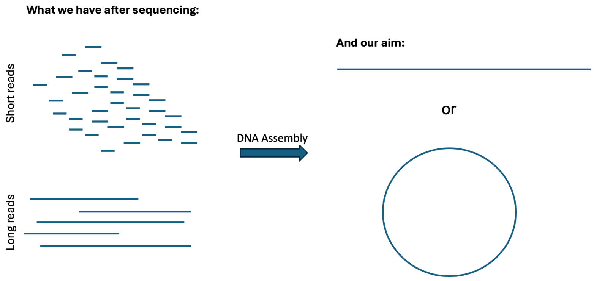
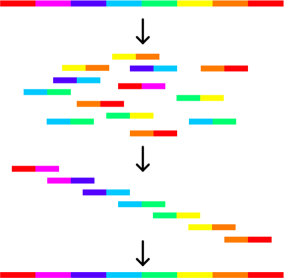
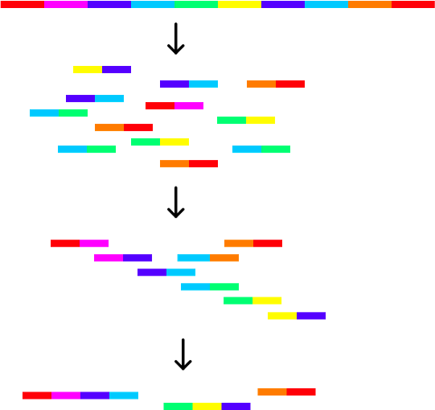
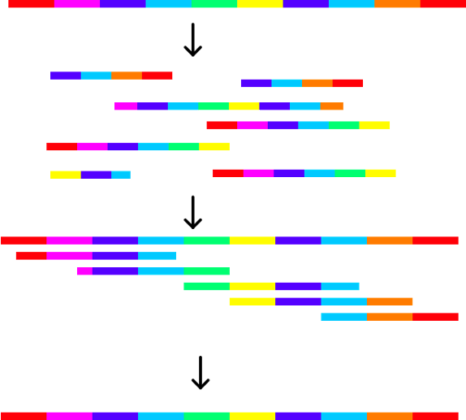
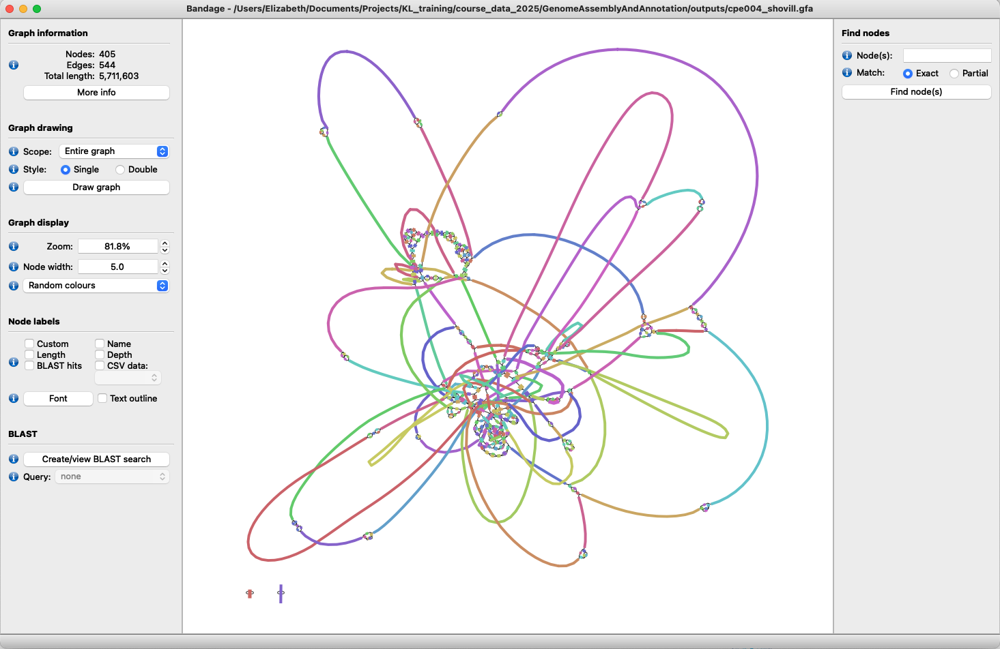

# Computational Practical: Genome Assembly and Annotation
Module developed by Fahad Khokhar and modified by Liz Batty.

## Table of Contents
1. [Introduction](#intro)
2. [Assembly graph and final assembly](#graphfinal)
3. [Software check](#software)
4. [Dataset](#dataset)
5. [Short-read assembly](#shortreads)
6. [Hybrid assembly](#hybrid)

## Introduction <a name="intro"></a>

Genome assembly is a key step in genomic analysis, enabling researchers to reconstruct the complete genomic sequence of an organism from raw sequencing data. This process is particularly significant for bacterial genomes, which are typically compact, circular, and rich in essential genetic information. Understanding bacterial genome assembly is essential for applications ranging from pathogen identification and antibiotic resistance profiling to studying microbial evolution and ecology.



The desired outcome is to achieve long contiguous DNA sequences (contigs). We will have to try to put fragmented DNA sequences back to its original, ordered continuous state (whether it is linear or circularized DNA), and this process is called genome assembly. The fundamental principal of genome assembly is to look for overlaps between fragments.

Imagine we are trying to reassemble the genome at the top of this figure from short reads. In this example, the genome is non-repetitive and the complete genome can be reassembled easily.



In this example, there is a repeat in the reference genome. Using the short reads, we cannot resolve the genome structure around this repeat.



This example has the same reference genome but the reads are of a longer length. As the reads are longer than the repeat region, the genome can be completely assembled.



## Assembly algorithms

### De Bruijn graphs

Short-read assemblers predominantly rely on de Bruijn graphs, which break the sequencing reads into fixed-lengths called k-mers. Overlaps between k-mers are identified and represented as edges in a graph, with k-mers as nodes. However, challenges arise with repetitive regions, which can create ambiguities in the graph structure.

### String graphs

Long-read assemblers use string graphs, which directly represent overlaps between entire reads instead of breaking them into k-mers. This method is well suited for long-read data, as the greater read lengths can span across repetitive regions and reduce fragmentation. String graphs allow for a more straightforward assembly process but requires accurate overlap detection and can also require error correction, particularly if using older long-read sequencing datasets. The resulting assemblies are often more contiguous, capturing complex genomic regions that are challenging for short-read assemblers.

### Assembly graph vs final assembly <a name="graphfinal"></a>

The two main files produced by genome assemblers are an assembly graph (.gfa) and the final genome assembly (.fasta). The assembly graph represents an intermediate output of the assembly process, detailing the connections between reads or contigs as nodes and edges in a graphical format. It includes unresolved regions, repetitive sequences, and possible alternative paths that are not yet fully resolved into a linear sequence. In contrast, the final assembly file provides a polished and linearised sequence of contigs, representing the best approximation of the bacterial genome after resolving ambiguities and filtering out alternative paths.

### Software check <a name="software"></a>

To check the tools required for this practical are correctly installed, open a new terminal
window and activate the conda environment for this module:

`conda activate GenomeAssemblyAndAnnotation`

Run the following commands in turn to make sure the software is installed correctly:

```
shovill -h
unicycler -h
prokka -h
```

If all are installed correctly, you should see the help page of each tool, and no error.

Navigate to your data directory: `course_data_2025/GenomeAssemblyAndAnnotation`

### Dataset <a name="dataset"></a>

In this practical, we will be using fastq files generated by both short-read paired-end Illumina sequencing, as well as long-read Nanopore sequencing, for a single sample (cpe004). The Illumina data was retrieved from accession ERR4095909, and the long-read data from
accession ERR8282741.

The fastq read files have already been processed with QC and filtering steps using the tools and commands shown below.

<details>

<summary>Pre-processing QC and filtering steps </summary>
Specifically, the Illumina paired-end files were processed using the same fastp command you used in Accessing Data and QC. The Nanopore long-reads have had adapters removed with Porechop, then filtered both on quality and read length with Filtlong, retaining only the best quality reads of minimum 1000 bp length.

| Program | Command |
|---|---|
|Fastp |fastp --in1 ERR4095909_1.fastq.gz --in2 ERR4095909_2.fastq.gz --out1 cpe004_R1.fastq.gz --out2 cpe004_R2.fastq.gz --length_required 40 --cut_front --cut_tail --cut_mean_quality 25 |
|Porechop | porechop -i cpe004_long.fastq.gz -o cpe004_porchop.fastq.gz |
|Filtlong | filtlong --min_length 1000 --keep_percent 95 cpe004_porechop.fastq.gz | gzip > cpe004_filtered.fastq.gz |

</details>

The files we will be using for this practical are listed below and are in the
`GenomeAssemblyAndAnnotation/data/` folder:
1. cpe004_R1.fastq.gz = Illumina read 1 (trimmed)
2. cpe004_R2.fastq.gz = Illumina read 2 (trimmed)
3. cpe004_filtered.fastq.gz = ONT reads (filtered)

### Short-read assembly <a name="shortreads"></a>

[Shovill](https://github.com/tseemann/shovill) is a tool to assemble bacterial isolate genomes from Illumina paired-end reads.

First, we will perform the genome assembly using only the short-read data. This will be performed using the Shovill tool which is a tool that optimises the SPAdes assembler.

```
shovill --cpus 1 --outdir shovill/ --R1 data/cpe004_R1.fastq.gz --R2 data/cpe004_R2.fastq.gz
cp shovill/contigs.fa cpe004_shovill.fasta
cp shovill/contigs.gfa cpe004_shovill.gfa
```

Breakdown of the command:

```
--cpus Number of CPUs to allocate to this task
--outdir Name of directory where results will be output
--R1 Read 1 sequencing file
--R2 Read 2 sequencing file
cp Copy and rename output files
```

Shovill produces several files in the output folder. The only two files we will use are:

`contigs.fa` - The final assembly file to be used

`contigs.gfa` - Assembly graph used to visualise the assembly

We rename these files with the sample name to make sure we know which sample they are from.

3. Count how many contigs the Shovill assembly has produced with this command:

`grep -c ">" cpe004_shovill.fasta`

NB: be careful when using the `grep` tool to look at FASTA format files - if you do not use quotes when looking for the ">" header character, it can look like the command which redirects the command line output into a file.

4. The assembly file should be ordered by contig size, so the largest contig will be reported at the top. Check the output of the first few lines of the assembly file with this command:

`head -n 4 cpe004_shovill.fasta`

5. Download and use the [Bandage](https://rrwick.github.io/Bandage/) tool to visualise the assembly graph produced by Shovill. Open the Bandage software and select File > Load graph > navigate to and select cpe004_shovill.gfa > Click on Draw graph
The result should look like the image below.



### Hybrid assembly  <a name="hybrid"></a>

Long-read sequencing has several advantages over short-read sequencing. Firstly, long reads can span over longer genomic regions and thus provide more contiguous sequences, leading to less fragmentation of the genome. This is particularly useful for resolving complex genomic regions such as repetitive sequences, structural variations, and regions with high GC-content.
Additionally, long-read sequencing can detect larger structural variations and can be used to phase haplotypes, allowing for the study of the inheritance of genomic regions. Moreover, long- read sequencing can also facilitate the detection and characterization of previously unknown or unannotated elements such as large transposable elements, viral sequences and mitochondrial DNA. Finally, long-reads also enable to sequence and assemble genomes from single cells, providing insights into the diversity and structure of genomes in mixed populations.

We will perform genome assembly using the long and short reads for the same sample, which is called hybrid assembly. We will use a tool called Unicycler, which will first create a short-read only assembly, then use the long reads to overlay on top of the assembly to hopefully resolve some of the regions.

Unicycler will take *up to one hour to run*, so start this command now and go for a coffee break.

```
unicycler -t 1 -o unicycler/ --mode bold --kmers 71 -1 data/cpe004_R1.fastq.gz -2 data/cpe004_R2.fastq.gz -l data/cpe004_filtered.fastq.gz
cp unicycler/assembly.fasta cpe004_hybrid.fasta
cp unicycler/assembly.gfa cpe004_hybrid.gfa
```

Command line breakdown:

```
-t Number of CPUs to allocate to this task
-1 Read 1 sequencing file
-2 Read 2 sequencing file
-l Long-read sequencing file
-o Output directory
--kmers Use a particular set of kmers in the graph build (applied here to speed up run time)
cp Copy and rename output files
```

Once the assembly is complete:

3. Use grep to display all contig header names and determine the number of contigs

4. Use Bandage to visualise the assembly graph

How does this compare to the short-read assembly?

### Assembly quality check

[Quality Assessment Tool for Genome Assemblies (QUAST)](https://github.com/ablab/quast) provides a comprehensive
evaluation of genome assemblies to assess contiguity and completeness. It can compare
assemblies against a reference when available, highlighting misassembles, mismatches, and
gaps. By integrating these quality metrics, researchers can identify areas for improvement and
compare the performance of different assembly tools.

| Metric | Description|
|---|---|
|Contigs |Number of contiguous DNA sequences assembled|
|Total length |Combined length of all contigs in an assembly|
|N50 |Length of the shortest contig such that 50% of the assembly is covered by contigs of this length or longer|
|N90 |As above but 90% of assembly|
|L50 |Minimum number of contigs required to cover 50% of the total assembly length|
|L90 |As above but 90% of assembly|

Quast is installed in the conda environment for the AccessingDataAndQc practical. Activate this environment now:

`conda activate AccessingDataAndQc`.

Run QUAST on both assemblies generated in this practical:

`quast cpe004_shovill.fasta cpe004_hybrid.fasta -o quast/`

View the results by opening the file `quast/report.html` with your browser.

Which assembly is better? Why?

### Genome annotation

Bacterial genome annotation is an important process for interpreting raw genomic data, transforming it into biologically meaningful insights. The process involves structural annotation, which identifies genomic features such as coding sequences (CDS), regulatory regions, and non-coding RNA (e.g. rRNA/tRNA), and functional annotation, which assigns putative roles to the elements based on comparative genomics and database analyses.
Tools such as [Prokka](https://github.com/tseemann/prokka) have revolutionised this workflow by offering an automated, high-throughput solution for generating annotated genome files. Utilising genome assembly fasta files, Prokka integrates curated databases and advanced algorithms to deliver precise predictions and functional assignments, facilitating robust and reproducible annotation.
The annotated genome files, commonly formatted as GFF3 (.gff), serve as foundational resources for a wide range of downstream applications. These include comparative genomics, phylogenetic analyses, as well as aiding in the development of diagnostic tools.

1. Use the following Prokka command to annotate the cpe004_hybrid.fasta assembly (this will take 20-30 minutes):

```
prokka --cpus 1 --prefix cpe004_hybrid --outdir prokka/ cpe004_hybrid.fasta
```

Prokka produces a number of output files:

| Extension | Description |
|---|---|
|.gff | This is the master annotation in GFF3 format, containing both sequences and annotations.|
|.gbk | This is a standard Genbank file derived from the master .gff. If the input to prokka was a multi-FASTA, then this will be a multi-Genbank, with one record for each sequence.|
|.fna |Nucleotide FASTA file of the input contig sequences.
|.faa |Protein FASTA file of the translated CDS sequences.
|.ffn |Nucleotide FASTA file of all the prediction transcripts (CDS, rRNA, tRNA, tmRNA, misc_RNA)|
|.sqn |An ASN1 format "Sequin" file for submission to Genbank. It needs to be edited to set the correct taxonomy, authors, related publication etc.|
|.fsa | Nucleotide FASTA file of the input contig sequences, used by "tbl2asn" to create the .sqn file. It is mostly the same as the .fna file, but with extra Sequin tags in the sequence description lines.|
|.err |Unacceptable annotations - the NCBI discrepancy report.|
|.log |Contains all the output that Prokka produced during its run.|
|.txt |Statistics relating to the annotated features found.|
|.tsv |Tab-separated file of all features|

2. Display the top 20 lines of the cpe004_hybrid.gff file

3. Search if any beta-lactamase resistance genes “bla” are present in this genome
