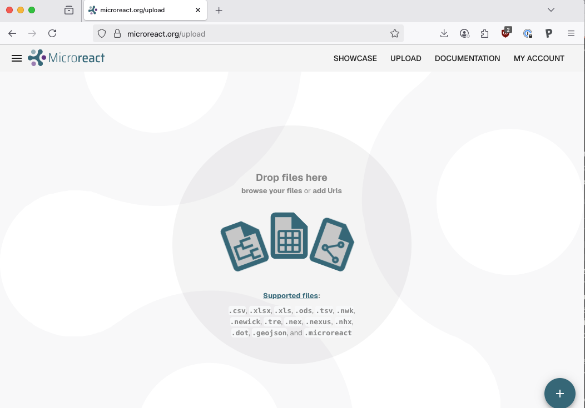
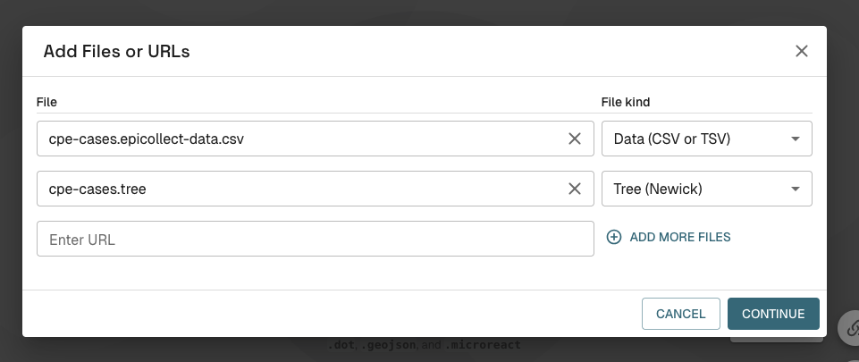
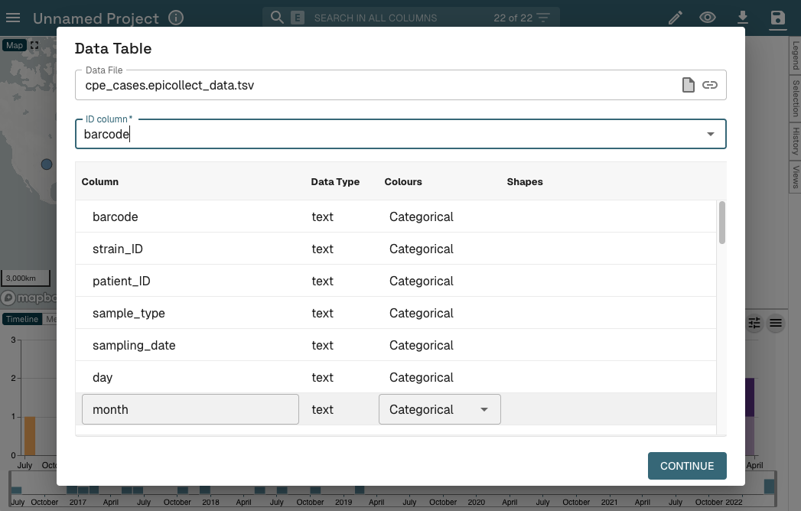
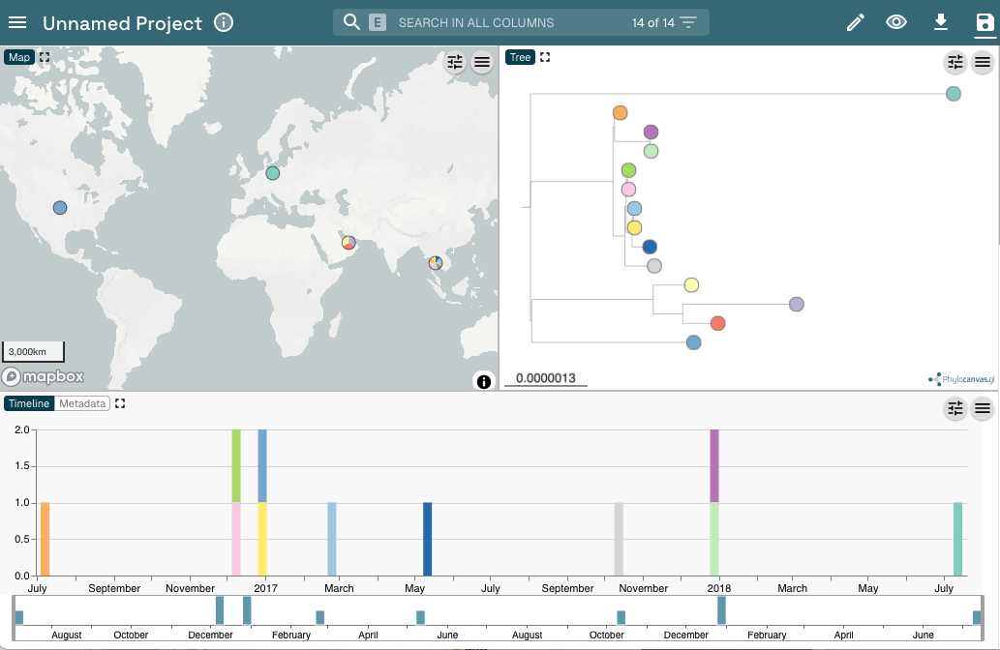
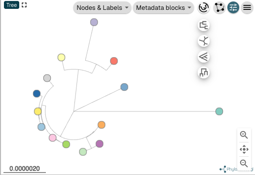
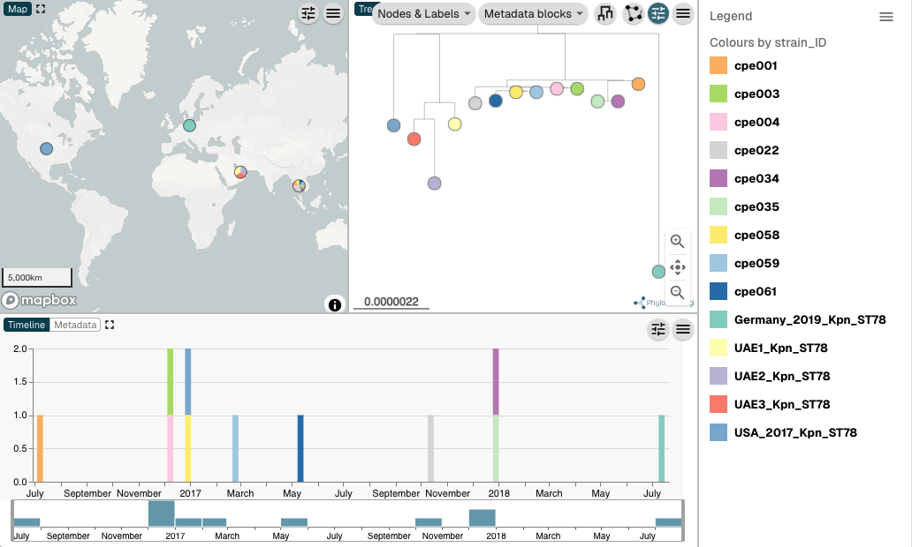

# Computation Practical: Visualising phylogenetic trees

## Table of Contents
1. [Uploading to Microreact](#upload)
2. [Customizing Microreact visualisations](#customize)
3. [AMR visualisation](#amr)
4. [Further exercises](#further)

## Uploading to Microreact 
We will start by visualising the outbreak tree we analysed earlier in the phylogenetics practical.
Start by opening a new window in Firefox and typing https://microreact.org/ in the address bar. Click on “Upload” and browse for the phylogenetic tree(cpe_cases.tree.nwk) and metadata files
(cpe_cases.epicollect_data.tsv) to create a new MicroReact project (Figure 1 and 2).

Once the tree and metadata files are loaded you will be directed to a new window where files will be automatically detected as Data (CSV or TSV) file (cpe_cases.epicollect_data.tsv) and Tree (Newick) file (cpe_cases.tree.nwk). In this new window click on ‘Continue’. In the next window, make sure the column ‘barcode’ is selected as the ‘ID Column’ and then click on ‘Continue’. The ‘ID column’ is the column in the metadata file that must match the strain labels in the phylogenetic tree (i.e. tip or leave labels).

Once the form is completed your data will be utilized to create a MicroReact project. You should now have a view like the one shown in Figure 3.

## Customizing Microreact 
You should see a Map, Tree, and Timeline panels. You can use click-drag-zoom to
navigate both the tree and the map. You can reorient the tree in different layouts to make it easier to view (Figure 4). Click the control panel symbol then click the tree-view control button then select the ‘Circular tree’ button (the last option at the bottom).

By default, the tree tips should be coloured by strain_ID. You can click on the ‘Legend’ button to view the colour legend.

Next, we will also display the strain IDs on the phylogenetic tree. Click on the ‘Labels, Colours, and Shapes’ icon and select ‘strain_ID’ under the lists ‘Labels Column’ and ‘Colour Column’ (Figure 5). You can also click the ‘Legend’ tab (top right) in the Microreact window to see a legend.

You should be able to see the clustering of _K. pneumoniae_ ST78 isolates from our outbreak with respect to the contextual ST78 isolates from other countries .

Question: is there any phylogenetic evidence of a single-source outbreak among the _K. pneumoniae_ ST78 isolates we are investigating? Or multiple circulating clones? Consider too the SNP distances we previously calculated by pairsnp or MEGA. Is there any evidence of phylogenetic clustering based on geography?

Next, click on the ‘Labels, Colours, and Shapes’ icon (the eye on the top blue bar) and select ‘patient_ID’ under the lists ‘Labels Column’ and ‘Colour Column’ (Figure 7). You can also click the ‘Legend’ tab (top right) in the Microreact window to see a legend.

Click on the ‘Show controls’ button to then click the ‘Nodes & Labels’ menu (above the tree) and toggle the ‘Leaf Labels’ button. Unselect ‘Align Leaf Labels’. Your tree should now look like Figure 8.

*Question:* can you identify any patient with more than one isolate on the phylogenetic tree? (note: ignore the contextual isolates with ‘NA’ patient_ID, i.e., those with unavailable patient_ID, which happen to have the same colour)

Next, zoom into the clade of outbreak cases and identify the clustering (sub-clades) of patients. Identify which patients have the most ancestral isolates in each of these sub-clades and consider the sampling time of CPE cases (visible in the Timeline panel).

*Question:* based on the temporal distribution and phylogenetic clustering of CPE cases, which patients might be among the early sources of the outbreak? Which patients could be ruled out as sources of the outbreak? *Important note:* we cannot infer the origin of an outbreak based solely on phylogenetic and temporal data, we would need to gather epidemiological data too (i.e., hospital contacts, hospital room stays).

## AMR visualisation 

Finally, we will explore the distribution of antibiograms and AMR genetic determinants. It is possible to view multiple variables against the tree simultaneously. First, click on the ‘Show controls’ button and under ‘Nodes & Labels’ menu to toggle both the ‘Leaf Labels’ and ‘Align Lead Labels’ buttons to switch on and make sure leaf labels are visible and aligned. Next, click the ‘Metadata blocks’ menu button and check all the boxes that relate to phenotypic antibiotic resistance (that is, from amikacin to piperacillin_tazobactam). See Figure 9.

This will allow us to visualise the entire antibiogram of our local CPE cases. You can look at the genotypic AMR data by setting a particular column as the leaf labels, or by visualising those columns in the metadata pane below the tree. Try disabling the columns you are not currently interested in and expanding the columns to see the complete text.

## Further exercises 

For a further example, see the [pdf](Phylogenetic_visualisation_exercise_2.pdf) for Exercise 2, which follows a Microreact visualisation for XDR _Salmonella typhi_ from Pakistan.
