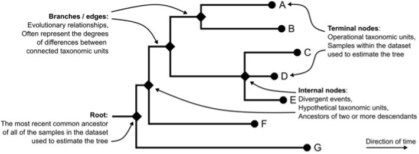
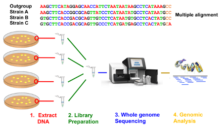
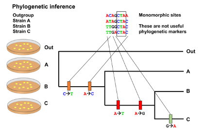
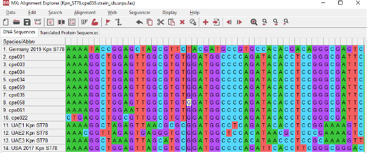
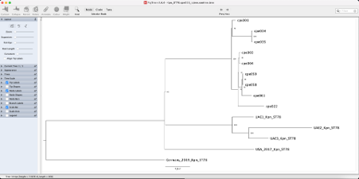
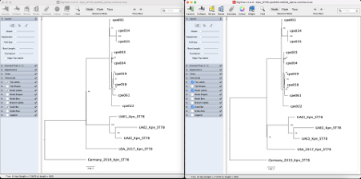

# Computation Practical 8: Analysing phylogenetic trees

Module Developers: Dr. Pakorn Aiewsakun and Dr Francesc Coll I Cerezo 

## Table of Contents
1. [Introduction to phylogenetic analysis](#intro)
2. [Expected learning outcomes](#outcomes)
3. [Creating a multiple sequence alignment](#alignment)
4. [Estimating a phylogeny](#estimating)
5. [Phylogeny estimation with bootstrapping](#bootstrapping)
6. [Rooting your tree](#rooting)
7. [How to read a phylogenetic tree?](#readtree)
8. [Relatedness](#relatedness)
9. [Trait evolution](#trait)
10. [Types of phylogenetic groups](#types)
11. [Detecting potential conflicting evolutionary signals within the MSA](#recombination)
12. [Phylogenetic network reconstruction](#network)
13. [Take-home messages](#messages)
14. [Answers to exercises on interpreting phylogenetic trees](#answers)
15. [Bibliography](#biblio)

---

## Introduction to phylogenetic analysis <a name="intro"></a>

**Phylogenetic analysis** is central to many areas of modern microbiological research, from pathogen classification to examination of pathogen-host co-evolution and tracking of transmission of infectious diseases. The main result from a phylogenetic analysis is a **phylogeny**, also known as **phylogenetic tree**, or simply a tree, depicting evolutionary relationships of a set of taxa – these can be different species or different strains of the same species, as it is often the case in genomic epidemiology studies. **Figure 1** to familiarise with commonly used phylogenetic terminology (e.g., internal nodes, branches, etc,). 

  
**Figure 1. Basic phylogenetic terminology. This figure has been reproduced from [Aiewsakun 2024](https://doi.org/10.1016/B978-0-323-99886-4.00013-2).** 

Ideally, we would like to have a complete knowledge of the entire genealogical history of the investigated taxa to draw their phylogeny, but such information is almost always impossible to ascertain. In practice, a phylogeny is commonly estimated from similarity of the investigated organisms’ **orthologous characters** (i.e., biological features with their most recent diversification event coincides with that of the organisms bearing them), with the assumption that the more similar the characters, the more likely that the organisms bearing them would be more closely related (i.e., sharing a more recent common ancestor). Theoretically speaking, any orthologous characters can be used to reconstruct a phylogeny under this framework; however, researchers nowadays most commonly use **DNA sequence data**, such as genes or genome sequences, for this purpose, due to its relative ease of generation, curation, interpretation, transferability, and reproducibility. A phylogeny estimated from molecular sequences is commonly referred to as a **molecular phylogeny**.

In the context of infectious disease epidemiology, a phylogenetic tree is commonly used to depict estimated evolutionary relationships between strains of the same bacterial species, which in turn can be used to track their transmission. Changes of population size can also affect how evolutionary changes accumulate on molecular sequences, and thus a phylogeny can also be analysed to estimate epidemiology dynamics as well. While bacteria typically reproduce its genome with high fidelity (estimated at 1 in 10 million to 1 in a billion base substitutions per nucleotide per generation, very much comparable to that of us human really), random errors (i.e., **mutations**) in DNA replication may still occur, and they can be passed down from one generation to the next. Some mutations are beneficial, while some can be neutral or deleterious. As time goes by, the frequency of beneficial mutations that increase the bacterial fitness (i.e., increase the chance of survival and / or reproductive success of the bacteria in the environment that they find themselves in) will tend to increase in the population, while the frequency of deleterious mutations, i.e., those that decrease the fitness, will tend to decrease as bacteria carrying them will tend to be outcompeted, out-survived, and out-reproduced by others. This in turn will result in continuous change of genetic composition of the bacterial population over time. This process is now known as **evolution by natural selection**, first proposed by Charles Darwin in 1859. Although the mutation rate of bacteria is not high, given their typically short generation times and large population size, a bacterial population will nearly always have mutants around, allowing natural selection to operate rather efficiently. Combined with the usually strong selection pressure that bacteria face constantly, for example from the host immune response, antimicrobial drugs, and other competing organisms, the genetic composition of a bacterial population can and do change substantially within a relatively short amount of time. It is all of these features combined that make molecular phylogenetic analysis of bacteria populations feasible and meaningful.

A bacterial phylogeny is typically estimated from a (set of) orthologous gene(s), more commonly from **polymorphic sites**, i.e., sites showing multiple forms of molecular variants within the population. The number and pattern of shared evolutionary changes between bacterial strains can be used to reconstruct their genealogical and evolutionary relationships. The advancement of sequencing technology nowadays also makes it possible to ‘read’ the entire bacterial genome virtually within a day at an affordable price. This allows researchers to estimate a bacterial phylogeny from genes or polymorphic sites sampled across their whole genome, providing the ultimate level of resolution possible to discriminate between closely related strains, and in turn the finest disease transmission history.

## Expected learning outcomes <a name="outcomes"></a>

After this practical session, you should be able to:
- familiarise with phylogenetic concepts and nomenclature;
- reconstruct a phylogeny from whole-genome sequences using a maximum likelihood framework;
- interpret a phylogeny and assess phylogenetic uncertainty;
- identify and mask recombination from whole-genome sequence alignments;
- understand how to handle conflicting evolutionary signals with phylogenetic network analysis;

## Creating a multiple sequence alignment <a name="alignment"></a>

The very first and arguably the most critical step in reconstructing a phylogeny from molecular sequences, i.e., **molecular phylogenetic reconstruction**, is to align molecular sequences (most often DNA sequences) of the studied organisms together to create a **multiple sequence alignment (MSA)**. With an MSA, we can then estimate the degree of organisms’ (dis)similarity or infer the process of evolutionary changes to estimate their phylogenetic tree. It is very important to note that all positions within the MSA should be **homologous positions** to ensure that we compare ‘like with like’, otherwise the resultant tree will be meaningless. While this might sound simple, in reality, it can oftentimes be difficult, if not entirely impractical, to ensure that all positions within our MSA are homologous positions, especially when the number of analysed organisms is large and they are highly diverse. When this happens, this issue must be dealt with utmost care, making sure that there are as many correctly aligned positions (or conversely as few potentially misaligned positions) as possible in the MSA, in order to obtain the most reliable and meaningful tree. Finding homologous sequences may be especially difficult when dealing with large and highly diverse organisms. In the context of genomic epidemiology investigations **whole-genome sequencing** of multiple strains of the same pathogen often leads to large numbers of **homologous core genes**, i.e., gene sequences that are shared among most strains of the same species and can be used to generate MSA.

**Figure 2** illustrates the common workflow to generate an MSA from a collection of bacterial strains. Generally, bacterial DNA is extracted from a single colony picked from culture plates (therefore commonly referred as to ‘**isolate**’), followed by sequencing library preparation and whole-genome sequencing using rapid benchtop sequencers. Raw sequence data generated by sequencers are then processed using bioinformatic and genomic pipelines, which generally involve read cleaning, and mapping them to a reference genome to reconstruct the isolate’s DNA sequence along the whole bacterial chromosome. With good quality control, mapping the reads of multiple sequenced isolates to the same reference genome is often the way to create an MSA while ensuring that all positions are **homologous positions**. 

  
**Figure 2. Common workflow (bottom) to generate a multiple sequence alignment (top) from a collection of bacterial strains.**

**Polymorphic sites** in the MSA provide information useful for evolutionary relationship inference (i.e., the more the similar the sequences among ‘orthologous’ polymorphic sites, the more likely they share a recent common ancestor), whereas monomorphic sites (nucleotide positions with all individuals showing the same molecular variants) are generally ignored (although it is a good practice to take these into account when specifying equilibrium base frequencies in the phylogenetic estimation, see below). **Figure 3** shows how polymorphic sites may inform phylogenetic estimation.

  
**Figure 3. How polymorphic sites may inform phylogenetic inference.** An example of a simple MSA of eight sites from four strains, which include monomorphic (squared) and polymorphic sites. Genetic changes in the phylogenetic tree are showed as coloured vertical rectangles on the branch where they originated. The identification of genetic changes (alleles) that are unique and common to multiple taxa (strains) are used to group them into phylogenetic clusters in a hierarchical manner with the goal of constructing the most plausible genealogical relationships between strains.

In the previous session, you we run **Snippy** to map the short Illumina reads and **call SNPs** for each individual CPE *Klebsiella pneumoniae* isolate from the suspected hospital outbreak. Now will attempt to construct a molecular phylogeny from this so-called *SNP alignment*.

First, concatenate all Snippy consensus sequences to create a **multi-sequence alignment (MSA)**. Remember all isolates were mapped to the same reference genome (the chromosome of ST78 cpe058 isolate). Here, we will create a **whole-genome alignment** by replacing SNPs and missing alleles called by Snippy along the DNA sequence of the reference genome for each isolate, so all resulting consensus sequences will have the same length (i.e., the length of the chromosome).

On your machine, to launch the Docker image, type:
```bash
docker run -it --mount type=bind,source=C:\Users\4M\Desktop\data,target=/home/data amr:Dockerfile
```


```bash
cd home/data/
git clone https://github.com/WCSCourses/AMR_2025/
mkdir cp8
```

Next copy the following files and scripts into cp8 directory:
```bash
cp ./AMR_2025/course_data_2025/cp8/snippy_files/* ./cp8/
cp ./AMR_2025/course_data_2025/cp8/replace_fasta_ids.py ./cp8/
cp ./AMR_2025/course_data_2025/cp8/Kpn_ST78.run_accessions.strain_ids.txt ./cp8/
```

Navidate to the module folder `cp8` where you should find the genome assemblies you just copied:
```bash
cd cp8
```

We will create the whole-genome sequence alignment by concatenating the Snippy consensus sequence of all 14 K. pneumoniae ST78 isolates:
```bash
cat *.consensus.fa > Kpn_ST78.cpe058.fas
```

Next, it is good practice to run tools like `seqkit` to confirm the expected length of the MSA and the total number of expected sequences in it:
```bash
seqkit stats Kpn_ST78.cpe058.fas --all --gap-letters "- . N"
```

Next, replace Illumina run accessions in the MSA FASTA file with their corresponding strain ids:
```bash
python3 replace_fasta_ids.py -i Kpn_ST78.cpe058.fas -t Kpn_ST78.run_accessions.strain_ids.txt -o Kpn_ST78.cpe058.strain_ids.fas
```
We can also manipulate the MSA to extract only polymorphic sites across all samples (i.e., SNPs):
```bash
snp-sites -c -m -o Kpn_ST78.cpe058.strain_ids.snps.fas Kpn_ST78.cpe058.strain_ids.fas
```

Finally, we will run `pairsnp`, a tool developed to quickly obtain pairwise SNP distance matrices from multiple sequence alignments:
```bash
pairsnp -c Kpn_ST78.cpe058.strain_ids.snps.fas > Kpn_ST78.cpe058.pairsnp.csv
```

Let’s have a look at your MSA with MEGA. MEGA is a program with a graphical user interface, which is free and easy to use. You can examine your MSA in MEGA by drag your MSA file to the program, and the program will ask “How would you like to open this fasta file?”. Click “Align”, and you should see your alignment as shown in **Figure 4**.

  
**Figure 4, MSA visualised in MEGA**

Q: How many positions are there in your MSA? Are there any ‘gaps’ / ‘missing bases’ in your alignment?

Q: Do you believe that all positions in your MSA are homologous positions? Why?

Q: Can you already roughly group your organisms into distinct clusters based on what you see? Is what you see consistent with what you already know about the bacterial isolates investigated? 

Q: Let’s have a closer look at your sequences, specifically their nucleotide composition. On the program’s main page, click “MODELS” > “Compute Nucleotide Composition”. Then a file navigation window will pop up. Locate and select your MSA file. The program will then ask you a couple more questions. Answer them based on your best understanding of the data. From the results, what is the average nucleotide composition of your MSA?

## 4. Estimating a phylogeny <a name="estimating"></a>

A large number of phylogenetic tree reconstruction methods have been developed, and based on their algorithmic natures and underlying philosophies, some of the most commonly used methods can be tentatively categorised into four large classes:

* i)	The **maximum parsimony methods**: this class of methods aims to identify the tree that requires the smallest number of evolutionary changes to explain the data.
  
* ii)	The **phenetic methods, also known as distance-based methods or distance-matrix methods**: methods of this class construct a tree diagram, or more precisely a **phenogram**, by applying a hierarchical clustering algorithm to a dataset of overall organismal pairwise dissimilarity. Strictly speaking, a phenogram does not show evolutionary relatedness, and simply shows the degree of overall dissimilarity among a group of organisms. Nevertheless, in practice, it is often the case that a phenogram will closely resembles the true evolutionary tree as there tend to be a significant correlation between over similarity and evolutionary relatedness.
  
* iii)	The **maximum likelihood (ML) methods**: as the name suggests, this class of methods aims to identify an evolutionary model that gives the highest **likelihood** score, which numerically, is equal to the probability that the model will generate the observed MSA. In essence, these methods try to identify a set of evolutionary parameters that will most likely generate the observed MSA. 

An evolutionary model can contain many parameters, including:
  * tree topology (i.e., the order of diversification events),
  * length of each branch in the tree (i.e., the number of molecular changes occurring along each branch),
  * equilibrium molecular state frequencies,
  * relative rates of molecular changes from one state to others (e.g., the probability that a base “A” will change to “T” within a certain among of time, etc.),
  * rate variation among lineages / branches, and
  * rate variation among sites within the MSA. 

As you can imagine, given this large number of evolutionary parameters with each having its own many sub-parameters, and each sub-parameter can also have an enormous range of possible values, an evolutionary landscape that an ML method has to explore is vast, and it would be almost always impractical to explore the entire landscape of all possible models.

Heuristic search is almost always needed to find the ML solution. Conceptually, in a heuristic search, you start somewhere randomly within an evolutionary landscape with a presumably random set of evolutionary parameters and compute a likelihood score. Then, change the values of the investigated evolutionary parameters a little bit, and see if the score changes. If the score changes, you ‘climb the hill’ by moving your model into the direction that increases the likelihood score the most. Repeat these steps until the score doesn’t increase any further, at which point it means that you have reached the top of the hill, and there you get it, an ML solution! However, a naïve hill-climbing algorithm might get you stuck at a local optimal hill, but luckily several algorithms have been developed to overcome this issue (to some degree). With the continuous advancement of heuristic search algorithms and computer hardware, it is now possible to estimate a (close-to-)ML tree from an MSA of thousands of bacterial complete genomes within a practical and reasonable amount of time. Also, one may want to start at several random points within the evolutionary model landscape and see if all reach to similar models; if so that is great! It supports that your answer might really be the ML answer.

* iv)	The **Bayesian inference methods**: methods of this class are closely related to the ML methods, but instead of asking “what is the evolutionary process that will most likely produce the observed MSA?”, these methods ask “given a prior belief of how a set of organisms may evolve, represented by a set of possible (but may be unequally likely) phylogenies and evolutionary models, how is the presumed belief updated upon seeing the actual sequence data?”. This ‘updated belief’ is more formally known as the **posterior probability distribution** of the models. Philosophically, one may argue that these methods are the most attractive among all methods discussed so far; “it computes what we most need, the probabilities of different hypotheses in the light of the data” (Felsenstein, 2004). Another very attractive feature of this class of methods is that, it is the only class of methods among the discussed four classes that intrinsically gives a distribution of models as an answer, and not just ‘the best model’ like the other three, naturally accommodating result uncertainty assessment. Nevertheless, there are some catches! The main catch is that, as hinted earlier, one would need to have their own prior beliefs about all possible evolutionary models beforehand for the math to work — i.e., one would need to assign probabilities to all evolutionary models that one wants to explore a priori even before doing the analysis, which is very difficult to do sensibly, and different **prior probability distributions** of the models can lead to different outcomes. Many people opt to use the program’s default settings for this, which is not the best thing to do. Similar to what suggested above for the ML method, several model prior probability distributions may also be explored to see if all inferences reach to the same / similar posterior probability distributions of the models. If so, then that’s great. It means that your data contain sufficient information to update your beliefs in the same direction no matter where you start. Otherwise, it might indicate that it is your belief that drives the outcomes, and not the data. Another catch is that methods of this class are also very computationally expensive — much more expensive than an ML method. In the ML method, you want just one ‘best solution’, but in a Bayesian method, you want to learn about the entire distribution of all possible models! As a result, what can be done within days by an ML method can take several weeks to complete with this approach even with a modern-day high-performance computer. So, for most common people, a Bayesian phylogenetic inference is only feasible with a relatively small dataset for now…

Here, we will use `IQ-TREE 2` to estimate an **ML phylogeny** from your MSA. `IQ-TREE 2` is an open-source command line tool that can perform a variety of phylogenetic analyses. 

To do this, open your computer ‘terminal’, and type:

```bash
iqtree2 -s Kpn_ST78.cpe058.strain_ids.fas -T 4 --mem 4G --ufboot 1000 --prefix Kpn_ST78.cpe058_iqtree -wbtl
```

Spend some time exploring what each of ``iqtree2`` parameters chosen mean - more information about IQTree2 options can be found by typing ``iqtree2 -h`` on your terminal – and identify the right output phylogenetic file.

That is it!

With this command, the program will infer an ML tree from your MSA file (as specified via the parameter `-s`), compute something called “clade support” based on 1,000 bootstrap MSAs (see below) using the ultrafast bootstrap approximation method (`--ufboot 1000`), and write the bootstrap trees into a file with branch length information (as specified by the flag `-wbtl`). 

Behind the scenes, this command also automatically selects the ‘best-fit nucleotide substitution model structure’ for you by using ModelFinder (see Box 1). This command also performs, under its default setting, the tree searching with 100 initial parsimony trees (`--ninit 100`). 20 top initial parsimony trees are subsequently optimised with ML nearest neighbour interchange search to initialise the candidate set (`--ntop 20)`, and the program then performs the ML tree search using the top 5 trees in the candidate set (`--nbest 5`).

Explore the variety of **output files** obtained from this run and identify which resulting phylogenetic tree file we should take forward.

Q: Given that **polymorphic sites** (i.e., SNP) are the most informative from an evolutionary point of view, why did not we use the MSA alignment with SNPs only? Note that we used the entire chromosomal MSA (which includes mostly monomorphic sites) as input for IQTree.

---
**Box1: Nucleotide substitution model selection**

There are three major components to a nucleotide substitution model, including:
* Equilibrium nucleotide frequencies: the simplest model structure is to restrict all nucleotide bases to be the same (25%; +FQ), while the most relaxed structure is to allow all bases to have their own frequency to be estimated by the program (+F: empirical base frequencies or +FO: ML optimised base frequencies).
* Relative transition rates among all 4 types of nucleotide bases: most common nucleotide substitution models are time-reversible, meaning that the rate of base X changes to Y (X -> Y) is constrained to be equal to the rate of Y->X, reducing the number of parameters to just 6 (A-C, A-G, A-T, C-G, C-T and G-T) from 12 (A->C, A->G, A->T, C->A, C->G, C->T, G->A, G->C, G->T, T->A, T->C, and T->G). The Jukes and Cantor 1969 (JC69) model has the simplest model structure, assuming all rates to be equal (and all four nucleotide frequencies to be equal as well), which is perhaps too simplistic / unrealistic for most cases. Other simple ones, but slightly more complicated, are the Kimura 1980 (K80) model and the Hasegawa, Kishino, and Yano 1985 (HKY85) model, which allow the rates of nucleotide transition (A-G, and C-T) and transversion changes (A-C, A-T, C-G, and G-T) to be different, with K80 assuming equal nucleotide frequencies while HKY85 allowing frequencies of different nucleotides to be different. The most general time-reversible model possible is called the Generalised Time-Reversible model of Tavaré 1986 or the GTR model, which allows nucleotide frequencies, and all of the six symmetrical rates of nucleotide changes to have different values. Note that `IQ-TREE 2` also has the unrestricted non-time reversible model implemented in it as well, in which the rate X-> Y is allowed to be different from that of Y->X, and the frequencies of the four base types can also be different. This model structure is very flexible; however, in order for this model to be meaningfully estimated, the program must somehow know from the beginning the direction of time in your phylogeny (by including some outgroups, for example, see below).
* Distribution of rate variation among sites within the MSA: Not all sites within the sequences evolve at the same rate. Some parts of a gene evolve faster than others; for example, an active site of an enzyme which is functionally important may be more conserved than others. When comparing several sequences to estimate a phylogeny, we should account for this rate heterogeneity to avoid errors. `IQ-TREE 2` supports site-wise rate heterogeneity modelling with various model structures. This includes:
  * “+I” model structure: allowing for a proportion within the MSA to be invariable sites.
  * “+G” model structure: modelling rate heterogeneity among sites by using the discrete Gamma model with default 4 rate categories (+G4).
  * “+I+G” model structure: invariable site plus discrete Gamma model.
  * “+R” model structure: FreeRate model that relaxes the assumption of Gamma-distributed rates, with default 4 rate categories (+R4).
  * “+I+R” model structure: invariable site plus FreeRate model.

Combined, a nucleotide substitution model may therefore be something like “GTR+F+I+R6”, which means that:
* The relative transition rates among “A”, “T”, “C”, and “G” base types are allowed to be different, but all are constrained to be time reversible (GTR), and…
* …their equilibrium state frequencies are taken to be equal to the empirical frequencies directly observed from the MSA (+F), and …
* … sites within the MSA are allowed have unequal overall rates of change, with 6 different rate categories (+R6), but …
* … some sites may not change at all (+I).

There are many more substitution models supported by `IQ-TREE 2`, such as Lie Markov models, codon models, or even protein models or binary and morphological models. You can learn more about them from http://www.iqtree.org/doc/Substitution-Models.

For each model structure, `IQ-TREE 2` will try to estimate ML parameter values, and compute AIC (Akaike information criterion), AICc (small-sample-size-corrected AIC), and BIC (Bayesian information criterion) scores for each of them. All of these scores take into consideration how likely the model will produce your data (the likelihood score), and the number of parameters within the model, but they are slightly different in term of how the number of parameters is penalised. Generally, the lower these scores, the more preferred the model. Under the default setting, the BIC score is used to decide the best-fit model structure (`--merit BIC`), i.e., the one with the lowest BIC score.

---

Q: What is the best fit nucleotide substitution model for your MSA? Can you make sense of it?

Now, let’s have a look at your tree in `Figtree`. `FigTree` is a program developed specifically for **phylogenetic tree visualisation**. And just like `MEGA` and `IQ-TREE` 2, it is free, and is quite easy to use!

To use `FigTree` to explore the tree you just made, first launch the program by simply double clicking the program icon. Click the menu “`File`” on the program’s menu bar, and select “`Open…`”, and a file navigation system should pop up. Search for your tree file, and then click “`Open`” to import the tree to the program. The program will alert you that “`The node/branches of the tree are labelled. Please select a name for these values.`” These are the bootstrap clade support values (see below). So, let us set the name of these labels to “`Clade support”` and click “`OK`”. The program should then show you your tree (**Figure 5**).

  
**Figure 5. Phylogenetic visualization with FigTree.**

Q: Inspect your ML tree using Figtree, and explore the program a bit. Does the tree look alright in your opinion? How are strains clustered on the tree? How good is the bootstrap value supporting this clustering? 

## 5. Phylogeny estimation with bootstrapping <a name="bootstrapping"></a>
See section in PDF manual of this module.

## 6. Rooting your tree <a name="rooting"></a>
See section in PDF manual of this module.

## 7. How to read a phylogenetic tree <a name="readtree"></a>
See section in PDF manual of this module.

## 8. Relatedness <a name="relatedness"></a>
See section in PDF manual of this module.

## 9. Trait evolution <a name="trait"></a>
See section in PDF manual of this module.

## 10. Types of phylogenetic groups <a name="types"></a>
See section in PDF manual of this module.

## 11. Detecting potential conflicting evolutionary signals within the MSA <a name="recombination"></a>

Owing to the now highly affordable and advanced sequencing technologies, phylogenetic analysis using entire whole genome sequences or gene sequences or SNP sites sampled across the entire genomes is now a common practice, especially in the field of bacteriology. This is actually precisely what we are doing here! It might not look like it as our SNP alignment is very short, but it contains all polymorphic sites from our bacteria’s entire genomes already! While this might not be applicable to us, generally, especially in a **large-scale phylogenomic** study of bacteria, reconstructing a phylogeny from whole genome sequence data is very challenging, if not problematic. This is in part due to that many bacteria often have so-called ‘**mosaic genomes**’, in which different regions have different past histories.

**Horizontal gene transfer (HGT)** — the process by which genetic material is transferred between (distinct lineages of) organisms — is very common among bacteria. Within a bacterial species, for example, it has been estimated that, on average, about 15.5% of accessory genes have undergone [HGT](https://doi.org/10.1038/s41467-017-00808-w). This phenomenon is in fact a well-known major driving force of the emergence of new virulent and drug-resistant bacterial strains, as well as the ability to evade [host immunity](https://doi.org/10.1186/S12864-019-6137-8). Indeed, most antibiotic resistance genes are found in [HGT hotspots](https://doi.org/10.1038/s41467-017-00808-w), supporting this view.

In the context of molecular phylogenetic reconstruction, it is commonly assumed that all sites within the analysed MSA have the same underlying tree (although different sites may allow to have different evolutionary rates and probabilities of character substitutions). If this assumption is met, then a single tree diagram is sufficient for depicting the histories of all features used in the analysis. However, this assumption is violated more often than not, especially in large-scale phylogenetic analysis of bacteria due to the pervasive HGT outlined above. Thus, it is best to always check for potential presence of mosaic sequences in the dataset analysed; otherwise, naïve application of a standard method to a dataset containing mosaic sequences, which often assumes all molecular sites to share the same underlying phylogeny, could potentially produce a severely biased tree (reviewed in [here](https://doi.org/10.1016/B978-0-323-99886-4.00013-2).

`SplitsTree` is, again, a free program with a graphic user interface for computing unrooted ‘phylogenetic’ networks from molecular sequence data (see below). To perform the Phi test on your MSA, open the program. Then click “`File`” > “`Open`”. A file navigation window should pop up. Locate your MSA file and then open the file in the program. The program will automatically generate a phylogenetic network for you, but let’s ignore it for now.

To perform phi test, click “`Analysis`” > “`Run Phi Test for Recombination`”.

Q: Does your MSA contain an overall significant signal of recombination?

Now, we will run **Gubbins (Genealogies Unbiased By recomBinations In Nucleotide Sequences)**, a commonly used bioinformatics tool to identify loci containing elevated densities of base substitutions, which are marked as recombination, and to build a phylogeny based on the putative point mutations outside of these regions.

Inside the Docker image, execute the commands below:

```bash
conda activate gubbins
align="Kpn_ST78.cpe058.strain_ids.fas";
prefix="Kpn_ST78.cpe058.gubbins";
run_gubbins.py $align --prefix $prefix --use-time-stamp --threads 4 --first-tree-builder fasttree --tree-builder raxml --outgroup Germany_2019_Kpn_ST78
```

Spend some time familiarising yourself with the options and parameters available on Gubbins:
```bash
run_gubbins.py -h
```

Next, inspect the output files generated by Gubbins:
```bash
ls -l Kpn_ST78.cpe058.gubbins*
```

Pay particular attention to the files containing the detected recombination (i.e., those named with *recombination_predictions.*) and check if any recombination has been detected.

We will use a script made available by Gubbins to mask recombinant regions detected by Gubbins from the input alignment:
```bash
mask_gubbins_aln.py --aln Kpn_ST78.cpe058.strain_ids.fas --gff Kpn_ST78.cpe058.gubbins.recombination_predictions.gff --out Kpn_ST78.cpe058.rmRCB.fas
conda deactivate
```

You can inspect this new alignment with `seqkit stats` to confirm the alignment contains the same number of sequences and length of the alignment:
```bash
seqkit stats Kpn_ST78.cpe058.rmRCB.fas
```

`pairsnp` can also be run to extract the new pairwise SNP distances from this alignment:
```bash
pairsnp -c Kpn_ST78.cpe058.rmRCB.fas > Kpn_ST78.cpe058.rmRCB.pairsnp.csv
```

Finally, let’s run `IQTree 2` on the latest alignment with masked recombination:
```bash
iqtree2 -s Kpn_ST78.cpe058.rmRCB.fas -T 4 --mem 4G --ufboot 1000 --prefix Kpn_ST78.cpe058.rmRCB_iqtree -wbtl
```

Note that output files have been named with the suffix ‘`rmRCB`’ (removed recombination) not to overwrite the output files generated by `iqtree2` earlier.

Compare the IQTree phylogenetic trees before (left tree in image below) and after removing recombination (on the right).

  
**Figure 16. FigTree visualisation of the *Klebsiella pneumoniae* ST78 tree before and after removing recombination.**

Q: What differences can be observed in the topology, clustering, and branch length of the trees?
Tip: inspect as well the pairwise SNP distances generated by pairsnp.

## 12. Phylogenetic network reconstruction <a name="network"></a>
See section in PDF manual of this module.

## 13. Take-home messages <a name="messages"></a>

Phylogenetic analysis is now a standard practice for microbiologists. Here, you have learnt the basic about how to estimate organismal phylogenetic relationships from molecular data, and how to interpret phylogenies. We have also covered a few methods to detect conflicting evolutionary signals within molecular data, and how to deal with them using phylogenetic network analysis. Additionally, we briefly touched on examining the phylogenetic structure of trait evolution and grouping. 

While this might seem like a lot already, this is just the beginning. The applications of phylogenetic analysis extend far beyond what we have covered here. To give you a few examples, phylogenetic analysis can be used to estimate effective population size dynamics, trace the detailed transmission history of pathogens, and establish correlations between genetic factors and phenotypic traits such as drug resistance. We hope that this practical has provided you a somewhat solid foundation and sparked your interest in the broader applications of phylogenetic analysis. 😊

Keep exploring! 

## 14. Answers to exercises on interpreting phylogenetic trees <a name="answers"></a>
See section in PDF manual of this module.

## 15. Bibliography <a name="biblio"></a>
    
Aiewsakun P. Microbial evolutionary reconstruction in the presence of mosaic sequences. *Phylogenomics*. 1st ed. Elsevier, 2024, 177–217.

Felsenstein J. Bayesian inference of phylogenies. *Inferring Phylogenies*. Sunderland: Sinauer Associates, Inc., 2004, 288–304.

Parts of this handout were developed and modified from handouts used in the workshop “The ripple effect of COVID-19 pandemic or respiratory virus research and healthcare: genetic analysis of influenza virus and SARS-CoV-2: SARS-CoV-2 phylogenetic analysis”, originally developed by Pakorn Aiewsakun.

